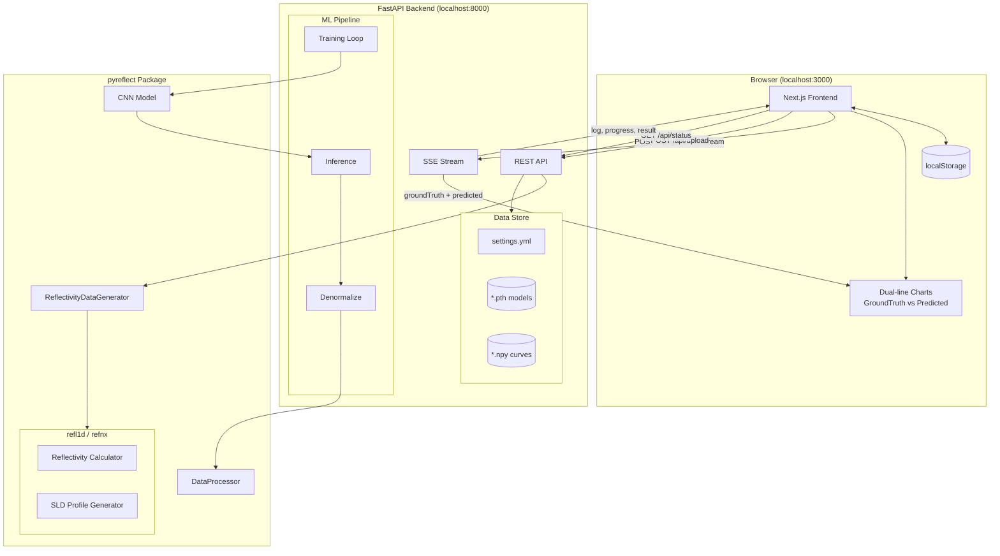
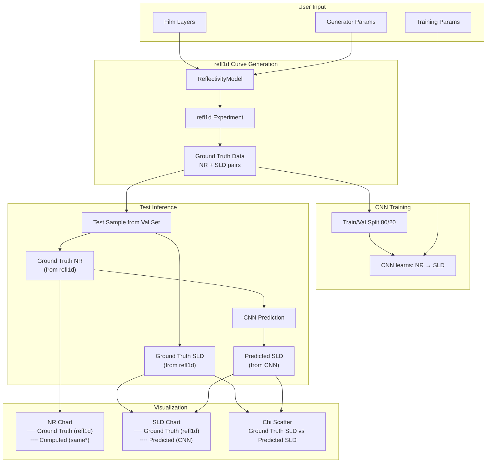
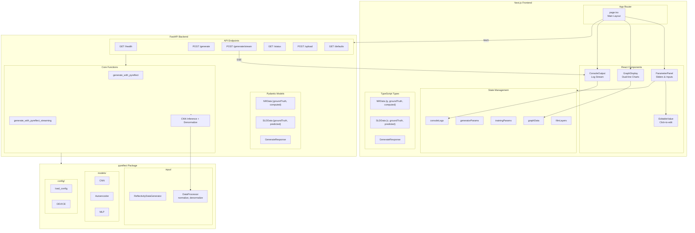
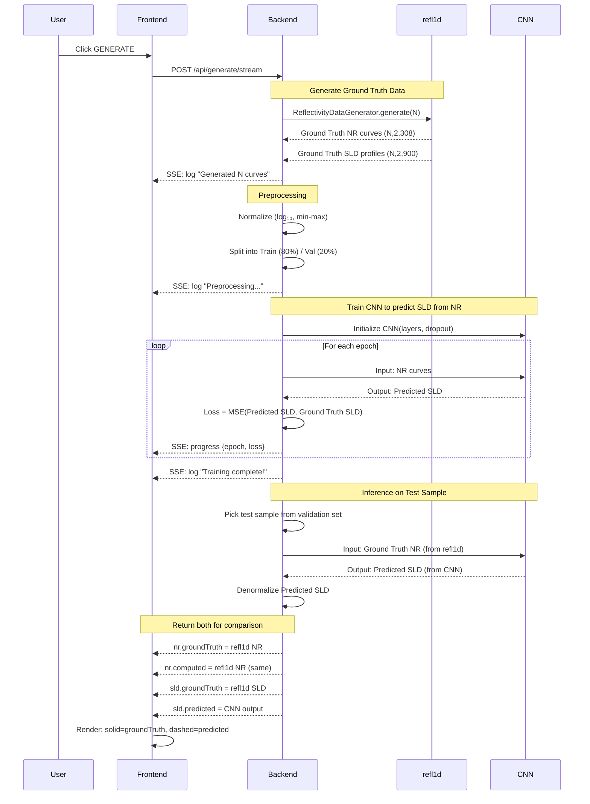

# PyReflect Interface

A minimal, monochrome web interface for the [pyreflect](https://github.com/williamQyq/pyreflect) neutron reflectivity analysis package.


## Version

- **v0.1.1** — GitHub auth, explore/history sidebar, and download bundle support.

## Features

- **Adjustable Parameters**: Film layers (SLD, thickness, roughness), generator settings, training configuration
- **Ground Truth vs Predicted**: NR and SLD charts show both ground truth (solid) and model predictions (dashed)
- **Graph Visualization**: Downloadable & interactive NR curves, SLD profiles, training loss, Chi parameter scatter plots
- **Monochrome Design**: Clean black/white aesthetic with JetBrains Mono font
- **Real-time Updates**: Instant parameter feedback with generate-on-demand
- **Editable Values**: Click any numeric value to type custom inputs beyond slider limits
- **Live Streaming Logs**: Real-time training progress streamed from backend via SSE
- **Timing + Warnings**: Generation/training/inference timings and backend warnings streamed to console
- **Data Upload**: Drag-and-drop upload for `.npy` datasets and `.pth` model weights
- **State Persistence**: Parameters and results persist across browser refreshes
- **Reset + Collapse**: One-click reset to example defaults and per-layer collapse/expand controls

## Project Structure

```
pyreflect-interface/
├── src/
│   ├── interface/          # Next.js frontend
│   └── backend/            # FastAPI backend
│       ├── main.py         # API server
│       ├── settings.yml    # Config (auto-generated)
│       └── data/           # Uploaded datasets & models
│           └── curves/     # NR/SLD curve files
└── README.md
```

> **Note**: The `pyreflect` package is installed directly from [GitHub](https://github.com/williamQyq/pyreflect) rather than bundled in this repo.

## Architecture

### System Overview



### Data Flow



#### Data Sources

| Field             | Source | Description                                              |
| ----------------- | ------ | -------------------------------------------------------- |
| `nr.groundTruth`  | refl1d | True reflectivity from physics simulation                |
| `nr.computed`     | refl1d | Same as groundTruth (future: compute from predicted SLD) |
| `sld.groundTruth` | refl1d | True SLD profile from physics simulation                 |
| `sld.predicted`   | CNN    | Model prediction given the NR curve as input             |

### Component Architecture



### Training Pipeline



## Quick Start

### Prerequisites

- [Bun](https://bun.sh) (frontend)
- [uv](https://docs.astral.sh/uv/) (backend)
- [Redis](https://redis.io/) (required for background job queue)

### 1. Backend Setup

```bash
cd src/backend
uv python pin 3.12
uv sync

# Start Redis (required for /api/jobs/* and /api/queue)
# macOS (Homebrew): brew install redis && redis-server
# Docker: docker run -p 6379:6379 redis:7

uv run uvicorn main:app --reload --port 8000
```

Backend runs at **http://localhost:8000**

### 2. Frontend Setup

```bash
cd src/interface
bun install
bun dev
```

Frontend runs at **http://localhost:3000**

### 3. GPU Worker (Optional - Modal)

For GPU-accelerated training (serverless, pay-per-use), deploy the Modal worker.

Important:
- Your backend must enqueue to a Redis instance reachable from Modal (`REDIS_URL`).
- Disable the backend's local worker so jobs aren't consumed on CPU (`START_LOCAL_RQ_WORKER=false`).
- `REDIS_URL=redis://localhost:6379` will NOT work with Modal (localhost is inside the Modal container).
- `REDIS_URL` must include a scheme like `redis://` (e.g. `redis://:PASSWORD@HOST:6379`).

```bash
cd src/backend

# Install backend + dev deps (includes Modal CLI)
uv sync

# Auth (pick one)
# Option A: browser/OAuth flow
uv run modal setup
#
# Option B: token flow (Modal dashboard -> Settings -> Tokens)
uv run modal token set --token-id <token-id> --token-secret <token-secret>

# Add your Redis secret (must match backend REDIS_URL).
# Modal containers can't read your local `.env`, and you shouldn't bake secrets into the image.
uv run modal secret create --force pyreflect-redis \
  REDIS_URL="redis://:PASSWORD@YOUR_PUBLIC_REDIS_HOST:6379" \
  MODEL_UPLOAD_URL="https://YOUR_PUBLIC_BACKEND_HOST:8000/api/models/upload" \
  MODEL_UPLOAD_TOKEN="change-me"

# Deploy (cron polls Redis and spawns a GPU RQ worker only when jobs are pending)
uv run modal deploy modal_worker.py
```

The worker automatically:

- Spins up a T4 GPU when jobs are queued
- Runs the same `service.jobs.run_training_job` code as local workers (progress, results, model uploads)
- If `MODEL_UPLOAD_URL` + `MODEL_UPLOAD_TOKEN` are set, uploads `.pth` back to your backend `data/models/` and deletes the Modal-local copy
- Scales down when idle (no cost)

**Verify end-to-end:**

- Backend: `GET /api/queue` should show `local_worker_enabled: false` and `remote_workers_compatible: true`.
- When you enqueue a training job, `queued_jobs` should become `> 0` briefly.
- Modal logs should show `pending=<N>` and then `Starting RQ SimpleWorker ... (burst mode)`:

```bash
cd src/backend
uv run modal app logs pyreflect-worker --timestamps
```

**Stop/Undeploy:**

```bash
cd src/backend
uv run modal app stop pyreflect-worker
```

#### Bare-metal Redis (required for Modal)

If your Redis runs on your own machine, **Modal can only reach it if it’s reachable from the public internet**.
That usually means your machine has a public IP (or you set up port-forwarding), and Redis is configured to accept
remote connections securely.

Minimum checklist (Redis host):

- Configure Redis to listen on a reachable interface (`bind 0.0.0.0` or your public NIC) and require auth (`requirepass` or ACLs).
- Open firewall / router port-forward for TCP `6379` to the Redis host.
- Confirm connectivity from outside your network: `redis-cli -h <public-host> -a <password> ping` (should return `PONG`).

If you can’t safely expose Redis publicly, use a managed Redis (Upstash / Redis Cloud) and point both the backend and Modal at it.

#### Does `modal deploy` run when I start `uvicorn`?

No. `uv run modal deploy ...` deploys the Modal app to Modal’s infra and runs independently. Starting `uvicorn` only starts the API server.

#### Why doesn’t it “auto-spawn” a GPU on deploy?

`modal deploy` registers your functions + schedule. In this project, the GPU worker is spawned by `poll_queue` on a cron (`* * * * *`).
To start immediately (for testing), run the poller once:

```bash
cd src/backend
uv run modal run modal_worker.py::poll_queue
```

### Troubleshooting

```bash
# Kill process on port 8000
lsof -ti:8000 | xargs kill -9

# Kill process on port 3000
lsof -ti:3000 | xargs kill -9
```

### Production Deployment

To deploy with resource limits (prevents abuse):

**Option 1: Environment variable**

```bash
PRODUCTION=true uv run uvicorn main:app --port 8000
```

**Option 2: Create `.env` file in `src/backend/`**

```env
# .env
PRODUCTION=true

# CORS (comma-separated origins)
CORS_ORIGINS=http://localhost:3000,https://your-app.vercel.app

# Redis queue (required for background jobs in the UI)
REDIS_URL=redis://localhost:6379
RQ_JOB_TIMEOUT=2h

# Remote worker model upload (Optional, for Modal GPU)
MODEL_UPLOAD_TOKEN=change-me
MODEL_UPLOAD_URL=https://your-backend.example.com/api/models/upload

# Disable local worker if using Modal/remote GPU workers
START_LOCAL_RQ_WORKER=false

# Optional: enable history + model downloads
#MONGODB_URI=mongodb+srv://...
#HF_TOKEN=hf_...
#HF_REPO_ID=your-username/pyreflect-models

# Optional: override individual limits
MAX_CURVES=5000
MAX_EPOCHS=50
MAX_BATCH_SIZE=64
MAX_CNN_LAYERS=12
MAX_DROPOUT=0.5
MAX_LATENT_DIM=32
MAX_AE_EPOCHS=100
MAX_MLP_EPOCHS=100
```

Then run normally:

```bash
uv run uvicorn main:app --port 8000
```

### Bare-metal Deployment (Backend + Redis)

If you want the backend + Redis on your own machine (and Modal only for GPU), the minimum flow is:

1) On the bare-metal host, run Redis and make it reachable from Modal (see “Bare-metal Redis” above).
2) Point the backend to that same `REDIS_URL` and disable the local worker:

```bash
cd src/backend
cp .env.example .env
# Edit:
#   REDIS_URL=redis://:PASSWORD@<your-public-host>:6379
#   START_LOCAL_RQ_WORKER=false
uv sync
uv run uvicorn main:app --host 0.0.0.0 --port 8000
```

3) Run the frontend either on the same host or locally, pointing it at your backend:

```bash
cd src/interface
NEXT_PUBLIC_API_URL=http://<baremetal-host>:8000 bun dev
```

Note: Modal workers do not share your bare-metal filesystem. To persist models on your machine, set `MODEL_UPLOAD_URL` + `MODEL_UPLOAD_TOKEN` (and configure the backend to accept uploads), or use Hugging Face uploads (`HF_TOKEN`, `HF_REPO_ID`).

## Vercel Deployment (Frontend)

### 1. Deploy frontend to Vercel

```bash
cd src/interface
vercel
```

### 2. Set environment variable in Vercel dashboard

| Variable              | Value                                                              |
| --------------------- | ------------------------------------------------------------------ |
| `NEXT_PUBLIC_API_URL` | `https://your-backend.railway.app` (or wherever backend is hosted) |

### 3. Configure backend CORS

In your backend `.env`, add your Vercel URL:

```env
CORS_ORIGINS=http://localhost:3000,https://your-app.vercel.app
```

---

**Production limits:**
| Parameter | Local | Production |
|-----------|-------|------------|
| Curves | 100,000 | 5,000 |
| Epochs | 1,000 | 50 |
| Batch Size | 512 | 64 |
| CNN Layers | 20 | 12 |
| Dropout | 0.9 | 0.5 |
| Latent Dim | 128 | 32 |
| AE/MLP Epochs | 500 | 100 |

### 3. Using the Interface

1. Adjust parameters in the left sidebar:

   - **Film Layers**: Add/remove layers, adjust SLD, thickness, roughness
   - **Generator**: Set number of curves and layers
   - **Training**: Configure batch size, epochs, dropout, etc.

2. Click **GENERATE** to compute and visualize:

   - **NR Chart**: Ground truth (solid) vs Computed (dashed)
   - **SLD Profile**: Ground truth (solid black) vs Predicted (dashed red)
   - **Training Loss**: Training and validation loss curves
   - **Chi Parameters**: Scatter plot of actual vs predicted SLD values

3. **Tips**:
   - Click any numeric value to type a custom number (e.g., 50000 curves)
   - Watch the console for real-time training progress, warnings, and timing
   - Use **RESET** to restore the example defaults
   - Use **COLLAPSE/EXPAND** to manage long film layer lists
   - Export individual graphs as CSV or all data as JSON
   - Charts show model predictions compared to ground truth after training

### 4. Uploading Data Files (Optional)

For pretrained models or existing datasets, use the **Data & Models** section:

```
Supported files:
├── *.npy          → Saved to src/backend/data/curves/
├── *.pth, *.pt    → Saved to src/backend/data/
└── settings.yml   → Saved to src/backend/
```

Files from `pyreflect/datasets/` can be uploaded:

- `normalization_stat.npy` - Normalization statistics
- `trained_nr_sld_model_no_dropout.pth` - Pretrained CNN model
- `X_train_5_layers.npy`, `y_train_5_layers.npy` - Training data

## API Endpoints

| Endpoint               | Method | Description                             |
| ---------------------- | ------ | --------------------------------------- |
| `/api/health`          | GET    | Health check                            |
| `/api/generate`        | POST   | Generate NR/SLD curves                  |
| `/api/generate/stream` | POST   | Generate with real-time SSE log stream  |
| `/api/defaults`        | GET    | Get default parameters                  |
| `/api/status`          | GET    | Backend status and available data files |
| `/api/upload`          | POST   | Upload dataset/model files              |

## Technology Stack

- **Frontend**: Next.js 16, React 19, TypeScript, Recharts
- **Backend**: FastAPI, Pydantic, NumPy
- **ML Package**: pyreflect (PyTorch, refl1d, refnx)

## Development

```bash
# Frontend development
cd src/interface
bun dev

# Backend development
cd src/backend
uv run uvicorn main:app --reload

# Build for production
cd src/interface
bun run build
```

## Credits

- [pyreflect](https://github.com/williamQyq/pyreflect) - NR-SCFT-ML package by Yuqing Qiao
- Based on research by Brian Qu, Dr. Rajeev Kumar, Prof. Miguel Fuentes-Cabrera
