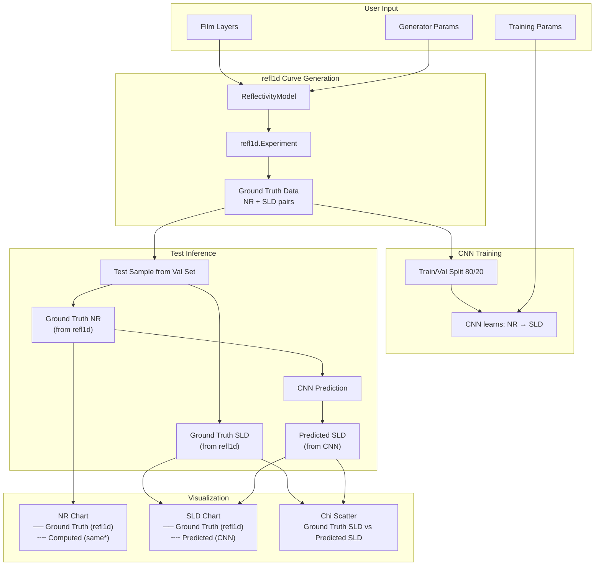
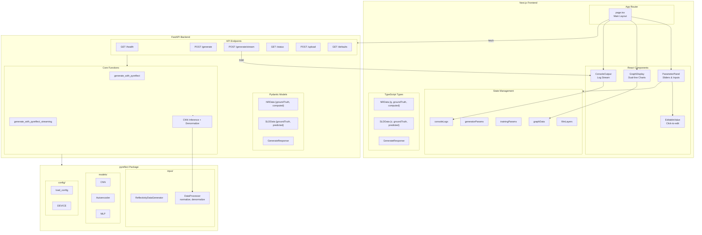
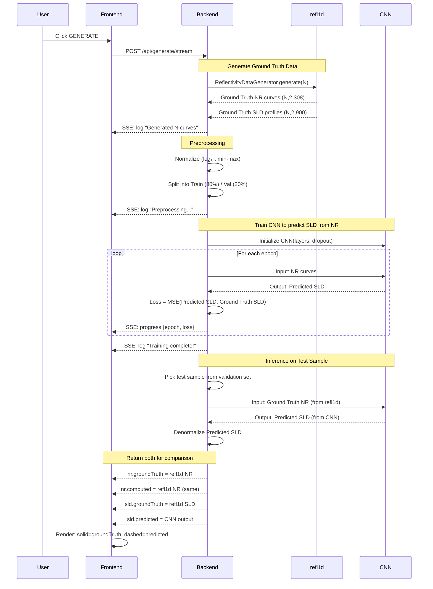

# PyReflect Interface

A minimal, monochrome web interface for the [pyreflect](https://github.com/williamQyq/pyreflect) neutron reflectivity analysis package.


## Version

- **v0.1.1** — GitHub auth, explore/history sidebar, and download bundle support.

## Live Deployment

- App: `https://pyreflect.shlawg.com`
- API: `https://api.shlawg.com`

The hosted deployment runs with the full stack enabled: Redis job queue + Modal GPU burst workers, MongoDB history persistence, and Hugging Face model storage.

## Features

- **Adjustable Parameters**: Film layers (SLD, thickness, roughness), generator settings, training configuration
- **Ground Truth vs Predicted**: NR and SLD charts show both ground truth (solid) and model predictions (dashed)
- **Graph Visualization**: Downloadable & interactive NR curves, SLD profiles, training loss, Chi parameter scatter plots
- **Monochrome Design**: Clean black/white aesthetic with JetBrains Mono font
- **Real-time Updates**: Instant parameter feedback with generate-on-demand
- **Editable Values**: Click any numeric value to type custom inputs beyond slider limits
- **Live Streaming Logs**: Real-time training progress streamed from backend via SSE
- **Timing + Warnings**: Generation/training/inference timings and backend warnings streamed to console
- **Data Upload**: Drag-and-drop upload for `.npy` datasets and `.pth` model weights
- **Background Jobs**: Redis + RQ queue for non-blocking training runs
- **GPU Training**: Modal T4 burst workers (spin up on demand, scale to zero)
- **Cloud Storage**: Hugging Face model artifacts + MongoDB history persistence
- **State Persistence**: Parameters and results persist across browser refreshes
- **Reset + Collapse**: One-click reset to example defaults and per-layer collapse/expand controls

## Project Structure

```
pyreflect-interface/
├── src/
│   ├── interface/          # Next.js frontend
│   └── backend/            # FastAPI backend
│       ├── main.py         # API server
│       ├── settings.yml    # Config (auto-generated)
│       └── data/           # Uploaded datasets & models
│           └── curves/     # NR/SLD curve files
└── README.md
```

> **Note**: The `pyreflect` package is installed directly from [GitHub](https://github.com/williamQyq/pyreflect) rather than bundled in this repo.

## Architecture

### System Overview

```mermaid
flowchart TB
    subgraph Browser["Browser (Next.js)"]
        UI[Next.js Frontend]
        Charts["Dual-line Charts<br/>GroundTruth vs Predicted"]
        LS[(localStorage)]
        UI <--> LS
        UI --> Charts
    end

    subgraph Backend["FastAPI Backend"]
        API[REST API]
        SSE[SSE Stream (fallback)]

        subgraph Pipeline["ML Pipeline"]
            Train[Training Loop]
            Infer[Inference]
            Denorm[Denormalize]
        end

        subgraph DataStore["Data Store"]
            Config[settings.yml]
            Models[(*.pth models)]
            Curves[(*.npy curves)]
        end
    end

    subgraph Queue["Redis + RQ"]
        RQ[(training queue)]
    end

    subgraph Modal["Modal (GPU burst workers)"]
        Poller[poll_queue_http (CPU)]
        Worker[run_rq_worker_burst (T4 GPU)]
    end

    subgraph Integrations["Integrations"]
        Mongo[(MongoDB history)]
        HF[(Hugging Face models)]
    end

    subgraph PyReflect["pyreflect Package"]
        Gen[ReflectivityDataGenerator]
        CNN[CNN Model]
        DP[DataProcessor]

        subgraph Physics["refl1d / refnx"]
            Refl[Reflectivity Calculator]
            SLD[SLD Profile Generator]
        end
    end

    UI -->|POST /api/jobs/submit| API
    UI -->|GET /api/jobs/{job_id}| API
    UI -->|GET /api/queue| API
    UI -->|POST /api/generate/stream| SSE
    UI -->|POST /api/upload| API
    UI -->|GET /api/status| API
    UI -->|GET /api/history| API
    SSE -->|log, progress, result| UI

    API -->|enqueue/poll| RQ
    API -->|trigger| Poller
    Poller -->|spawn| Worker
    Worker -->|consume| RQ
    Worker --> Mongo
    Worker --> HF
    API --> Mongo
    API --> HF

    API --> DataStore
    API --> Gen
    Gen --> Physics
    Train --> CNN
    CNN --> Infer
    Infer --> Denorm
    Denorm --> DP

    SSE -->|groundTruth + predicted| Charts
```

### Data Flow



#### Data Sources

| Field             | Source | Description                                              |
| ----------------- | ------ | -------------------------------------------------------- |
| `nr.groundTruth`  | refl1d | True reflectivity from physics simulation                |
| `nr.computed`     | refl1d | Same as groundTruth (future: compute from predicted SLD) |
| `sld.groundTruth` | refl1d | True SLD profile from physics simulation                 |
| `sld.predicted`   | CNN    | Model prediction given the NR curve as input             |

### Component Architecture



### Training Pipeline



## Quick Start

### Prerequisites

- [Bun](https://bun.sh) (frontend)
- [uv](https://docs.astral.sh/uv/) (backend)
- [Redis](https://redis.io/) (required for the job queue + `/api/jobs/*`)
- Optional (production stack): MongoDB, Hugging Face, Modal

### 1. Backend Setup

```bash
cd src/backend
uv python pin 3.12
uv sync

# Start Redis (required for /api/jobs/* and /api/queue)
# macOS (Homebrew): brew install redis && redis-server
# Docker: docker run -p 6379:6379 redis:7

uv run uvicorn main:app --reload --port 8000
```

Backend runs at **http://localhost:8000**

### 2. Frontend Setup

```bash
cd src/interface
bun install
bun dev
```

Frontend runs at **http://localhost:3000**

### 3. GPU Worker (Modal, used in production)

For GPU-accelerated training (serverless, pay-per-use), deploy the Modal worker.

Important:
- Your backend must enqueue to a Redis instance reachable from Modal (`REDIS_URL`).
- Disable the backend's local worker so jobs aren't consumed on CPU (`START_LOCAL_RQ_WORKER=false`).
- `REDIS_URL=redis://localhost:6379` will NOT work with Modal (localhost is inside the Modal container).
- `REDIS_URL` must include a scheme like `redis://` (e.g. `redis://:PASSWORD@HOST:6379`).
- For instant spawn (no waiting for a periodic schedule), the backend process must have the `modal` package installed and be authenticated to Modal.
  If that fails, you can configure an HTTP fallback (`MODAL_POLL_URL`).

Redis URL examples:
- Password-only Redis: `redis://:<PASSWORD>@HOST:6379/0`
- ACL Redis (common user is `default`): `redis://default:<PASSWORD>@HOST:6379/0`

```bash
cd src/backend

# Install backend + dev deps (includes Modal CLI)
uv sync

# Auth (pick one)
# Option A: browser/OAuth flow
uv run modal setup
#
# Option B: token flow (Modal dashboard -> Settings -> Tokens)
uv run modal token set --token-id <token-id> --token-secret <token-secret>

# Add your Redis secret (must match backend REDIS_URL).
# Modal containers can't read your local `.env`, and you shouldn't bake secrets into the image.
uv run modal secret create --force pyreflect-redis \
  REDIS_URL="redis://:PASSWORD@YOUR_PUBLIC_REDIS_HOST:6379" \
  HF_TOKEN="hf_..." \
  HF_REPO_ID="your-username/pyreflect-models" \
  MODEL_STORAGE="hf" \
  MODAL_TRIGGER_TOKEN="change-me" \
  MONGODB_URI="mongodb+srv://..."  # Optional: enables history persistence from Modal

# Deploy (backend triggers an instant spawn; optional HTTP trigger is a fallback)
uv run modal deploy modal_worker.py
```

The worker automatically:

- Spins up a T4 GPU when jobs are queued
- Runs the same `service.jobs.run_training_job` code as local workers (progress, results, model uploads)
- Uploads the model directly to Hugging Face when `MODEL_STORAGE=hf` (no backend model storage)
- Scales down when idle (no cost)

**Verify end-to-end:**

- Backend: `GET /api/queue` should show `local_worker_enabled: false` and `remote_workers_compatible: true`.
- When you enqueue a training job, `queued_jobs` should become `> 0` briefly.
- Modal logs should show `pending=<N>` and then `Starting RQ SimpleWorker ... (burst mode)`:

```bash
cd src/backend
uv run modal app logs pyreflect-worker --timestamps
```

**Stop/Undeploy:**

```bash
cd src/backend
uv run modal app stop pyreflect-worker
```

#### Bare-metal Redis (required for Modal)

If your Redis runs on your own machine, **Modal can only reach it if it’s reachable from the public internet**.
That usually means your machine has a public IP (or you set up port-forwarding), and Redis is configured to accept
remote connections securely.

Minimum checklist (Redis host):

- Configure Redis to listen on a reachable interface (`bind 0.0.0.0` or your public NIC) and require auth (`requirepass` or ACLs).
- Open firewall / router port-forward for TCP `6379` to the Redis host.
- Confirm connectivity from outside your network: `redis-cli -h <public-host> -a <password> ping` (should return `PONG`).

If you can’t safely expose Redis publicly, use a managed Redis (Upstash / Redis Cloud) and point both the backend and Modal at it.

#### Does `modal deploy` run when I start `uvicorn`?

No. `uv run modal deploy ...` deploys the Modal app to Modal’s infra and runs independently. Starting `uvicorn` only starts the API server.

#### Why doesn’t it “auto-spawn” a GPU on deploy?

`modal deploy` registers your functions. By default, the backend will try to trigger a GPU worker immediately
after enqueuing a job (`MODAL_INSTANT_SPAWN=true`). The Modal worker also exposes an optional HTTP trigger (`poll_queue_http`)
so you can trigger spawns without relying on the backend being authenticated to Modal.

To debug instant spawn from the backend, call:

```bash
curl -s -X POST http://localhost:8000/api/queue/spawn | jq
```

The backend also opportunistically triggers a spawn from `GET /api/queue` when it sees queued jobs and no workers.

If you see `reason: modal_spawn_failed`, the backend is not authenticated to Modal. Run `uv run modal setup` (or set
`MODAL_TOKEN_ID` + `MODAL_TOKEN_SECRET` in the backend environment).

If you see `reason: modal_spawn_failed` and want an auth-free backend, set these backend env vars:
- `MODAL_POLL_URL`: the deployed `poll_queue_http` endpoint URL (from Modal deploy output)
- `MODAL_TRIGGER_TOKEN`: must match the `MODAL_TRIGGER_TOKEN` stored in the Modal secret (sent as `?token=...`)

Note on cost: the on-demand `poll_queue` does not “keep a container warm” 24/7. Modal bills for compute time used by each
invocation; the poller is intentionally lightweight (1 vCPU, minimal deps) and exits quickly when the queue is empty.

To start immediately (for testing), run the poller once:

```bash
cd src/backend
uv run modal run modal_worker.py::poll_queue
```

### Troubleshooting

If you see a Modal DNS error with `%0a` or spaces in the hostname, your `MODAL_POLL_URL` value contains whitespace/newlines.
Set `MODAL_POLL_URL` as a single line URL (no line wrapping) and restart the backend.

```bash
# Kill process on port 8000
lsof -ti:8000 | xargs kill -9

# Kill process on port 3000
lsof -ti:3000 | xargs kill -9
```

### Production Deployment

To deploy with resource limits (prevents abuse):

**Option 1: Environment variable**

```bash
PRODUCTION=true uv run uvicorn main:app --port 8000
```

**Option 2: Create `.env` file in `src/backend/`**

```env
# .env
PRODUCTION=true

# CORS (comma-separated origins)
CORS_ORIGINS=http://localhost:3000,https://your-app.vercel.app
# Or use a regex allowlist (useful for multiple subdomains):
#CORS_ALLOW_ORIGIN_REGEX=https://(pyreflect\.shlawg\.com|localhost:3000)$

# Redis queue (required for background jobs in the UI)
REDIS_URL=redis://localhost:6379
RQ_JOB_TIMEOUT=2h

# Instant Modal worker spawn (on-demand, no schedule)
MODAL_INSTANT_SPAWN=true
MODAL_POLL_URL=https://<your-modal-endpoint>/poll_queue_http
MODAL_TRIGGER_TOKEN=change-me  # must match Modal secret MODAL_TRIGGER_TOKEN (sent as ?token=...)

# Disable local worker if using Modal/remote GPU workers
START_LOCAL_RQ_WORKER=false

# History + model storage (used in the hosted deployment)
MONGODB_URI=mongodb+srv://...
HF_TOKEN=hf_...
HF_REPO_ID=your-username/pyreflect-models
MODEL_STORAGE=hf

# Optional: override individual limits
MAX_CURVES=5000
MAX_EPOCHS=50
MAX_BATCH_SIZE=64
MAX_CNN_LAYERS=12
MAX_DROPOUT=0.5
MAX_LATENT_DIM=32
MAX_AE_EPOCHS=100
MAX_MLP_EPOCHS=100
```

Then run normally:

```bash
uv run uvicorn main:app --port 8000
```

### Bare-metal Deployment (Backend + Redis)

If you want the backend + Redis on your own machine (and Modal only for GPU), the minimum flow is:

1) On the bare-metal host, run Redis and make it reachable from Modal (see “Bare-metal Redis” above).
2) Point the backend to that same `REDIS_URL` and disable the local worker:

```bash
cd src/backend
cp .env.example .env
# Edit:
#   REDIS_URL=redis://:PASSWORD@<your-public-host>:6379
#   START_LOCAL_RQ_WORKER=false
uv sync
uv run uvicorn main:app --host 0.0.0.0 --port 8000
```

3) Run the frontend either on the same host or locally, pointing it at your backend:

```bash
cd src/interface
NEXT_PUBLIC_API_URL=http://<baremetal-host>:8000 bun dev
```

Note: Modal workers do not share your bare-metal filesystem. For fastest end-to-end, store models on Hugging Face (`MODEL_STORAGE=hf` + `HF_TOKEN` + `HF_REPO_ID`) so the backend can redirect downloads to HF without any model upload back to the backend.

## Vercel Deployment (Frontend)

### 1. Deploy frontend to Vercel

```bash
cd src/interface
vercel
```

### 2. Set environment variable in Vercel dashboard

| Variable              | Value                                                              |
| --------------------- | ------------------------------------------------------------------ |
| `NEXT_PUBLIC_API_URL` | `https://your-backend.railway.app` (or wherever backend is hosted) |

### 3. Configure backend CORS

In your backend `.env`, add your Vercel URL:

```env
CORS_ORIGINS=http://localhost:3000,https://your-app.vercel.app
```

---

**Production limits:**
| Parameter | Local | Production |
|-----------|-------|------------|
| Curves | 100,000 | 5,000 |
| Epochs | 1,000 | 50 |
| Batch Size | 512 | 64 |
| CNN Layers | 20 | 12 |
| Dropout | 0.9 | 0.5 |
| Latent Dim | 128 | 32 |
| AE/MLP Epochs | 500 | 100 |

### 3. Using the Interface

1. Adjust parameters in the left sidebar:

   - **Film Layers**: Add/remove layers, adjust SLD, thickness, roughness
   - **Generator**: Set number of curves and layers
   - **Training**: Configure batch size, epochs, dropout, etc.

2. Click **GENERATE** to compute and visualize:

   - **NR Chart**: Ground truth (solid) vs Computed (dashed)
   - **SLD Profile**: Ground truth (solid black) vs Predicted (dashed red)
   - **Training Loss**: Training and validation loss curves
   - **Chi Parameters**: Scatter plot of actual vs predicted SLD values

3. **Tips**:
   - Click any numeric value to type a custom number (e.g., 50000 curves)
   - Watch the console for real-time training progress, warnings, and timing
   - Use **RESET** to restore the example defaults
   - Use **COLLAPSE/EXPAND** to manage long film layer lists
   - Export individual graphs as CSV or all data as JSON
   - Charts show model predictions compared to ground truth after training

### 4. Uploading Data Files

For pretrained models or existing datasets, use the **Data & Models** section:

```
Supported files:
├── *.npy          → Saved to src/backend/data/curves/
├── *.pth, *.pt    → Saved to src/backend/data/
└── settings.yml   → Saved to src/backend/
```

Files from `pyreflect/datasets/` can be uploaded:

- `normalization_stat.npy` - Normalization statistics
- `trained_nr_sld_model_no_dropout.pth` - Pretrained CNN model
- `X_train_5_layers.npy`, `y_train_5_layers.npy` - Training data

## API Endpoints

| Endpoint                      | Method | Description                             |
| ----------------------------- | ------ | --------------------------------------- |
| `/api/health`                 | GET    | Health check                            |
| `/api/limits`                 | GET    | Current limits and production flag      |
| `/api/defaults`               | GET    | Default parameters                      |
| `/api/generate`               | POST   | Generate NR/SLD curves (non-streaming)  |
| `/api/generate/stream`        | POST   | Generate with SSE log stream            |
| `/api/status`                 | GET    | Backend status and data files           |
| `/api/upload`                 | POST   | Upload files (+ optional roles)         |
| `/api/history`                | GET    | List saved generations                  |
| `/api/history`                | POST   | Save a generation manually              |
| `/api/history/{id}`           | GET    | Get full details of a save              |
| `/api/history/{id}`           | PATCH  | Rename a saved generation               |
| `/api/history/{id}`           | DELETE | Delete a saved generation and its model |
| `/api/models/upload`          | POST   | Receive model upload from remote worker |
| `/api/models/{model_id}`      | GET    | Download a saved model                  |
| `/api/models/{model_id}`      | DELETE | Delete a local model file               |
| `/api/models/{model_id}/info` | GET    | Get model size and source               |
| `/api/jobs/submit`            | POST   | Submit job to queue (non-blocking)      |
| `/api/jobs/{job_id}`          | GET    | Get job status, progress, and result    |
| `/api/jobs/{job_id}`          | DELETE | Cancel a queued job                     |
| `/api/jobs/{job_id}/name`     | PATCH  | Rename a queued job                     |
| `/api/jobs/{job_id}/retry`    | POST   | Retry a failed/finished job             |
| `/api/jobs/{job_id}/stop`     | POST   | Request a running job stop              |
| `/api/jobs/{job_id}/delete`   | DELETE | Delete a job record (non-running only)  |
| `/api/jobs/{job_id}/claim`    | POST   | Attach a job to a user (login mid-run)  |
| `/api/jobs/purge`             | DELETE | Delete non-running jobs for a user      |
| `/api/queue`                  | GET    | Queue status and worker info            |
| `/api/queue/spawn`            | POST   | Trigger remote worker spawn (debug)     |

## Technology Stack

- **Frontend**: Next.js 16, React 19, TypeScript, Recharts
- **Backend**: FastAPI, Pydantic, NumPy
- **ML Package**: pyreflect (PyTorch, refl1d, refnx)

## Development

```bash
# Frontend development
cd src/interface
bun dev

# Backend development
cd src/backend
uv run uvicorn main:app --reload

# Build for production
cd src/interface
bun run build
```

## Credits

- [pyreflect](https://github.com/williamQyq/pyreflect) - NR-SCFT-ML package by Yuqing Qiao
- Based on research by Brian Qu, Dr. Rajeev Kumar, Prof. Miguel Fuentes-Cabrera
