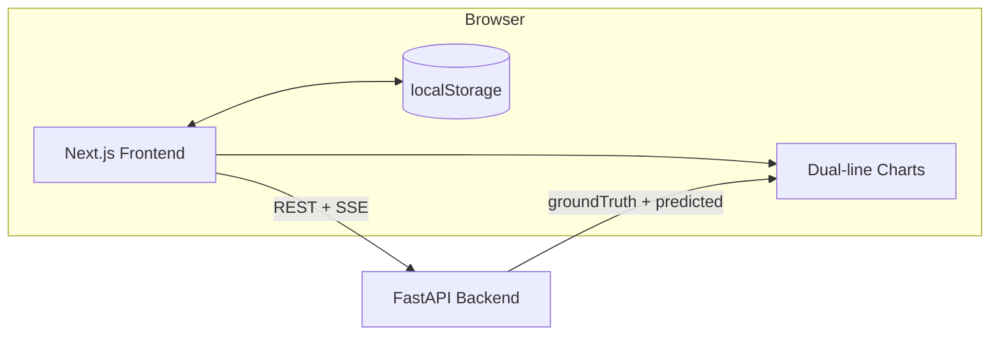
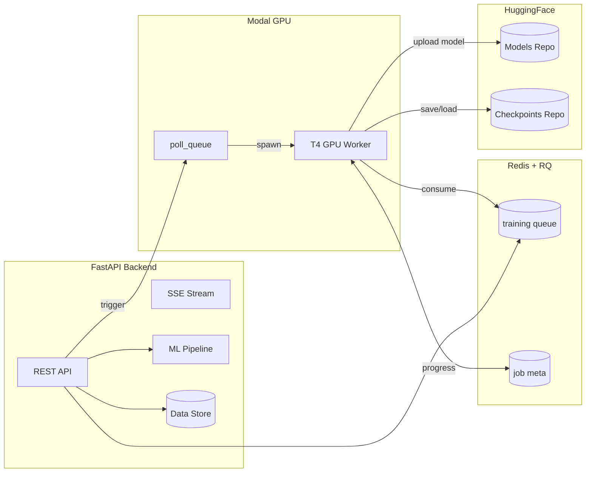
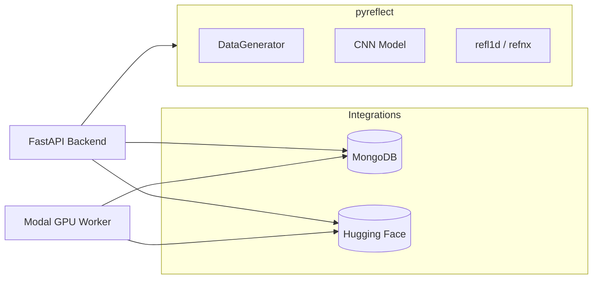
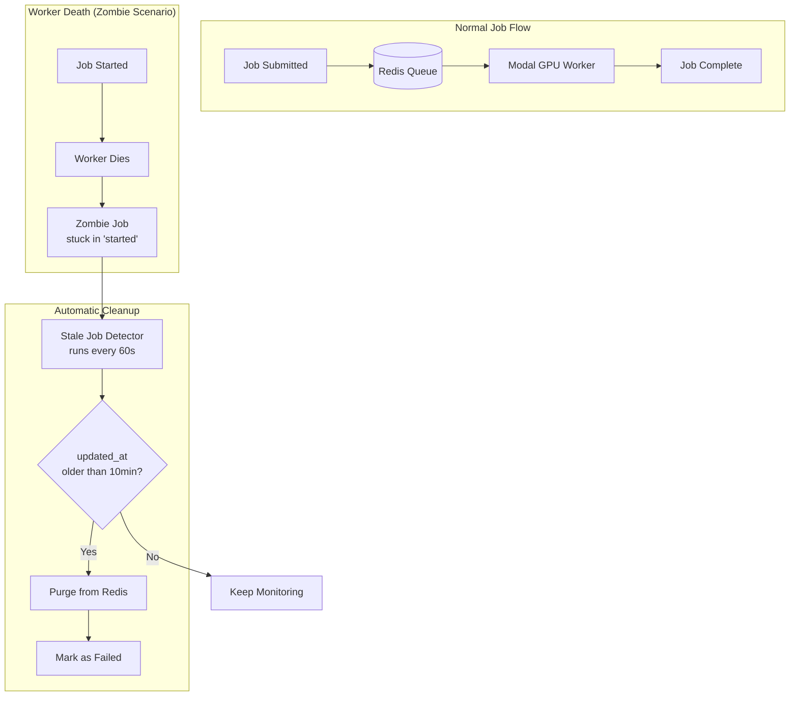
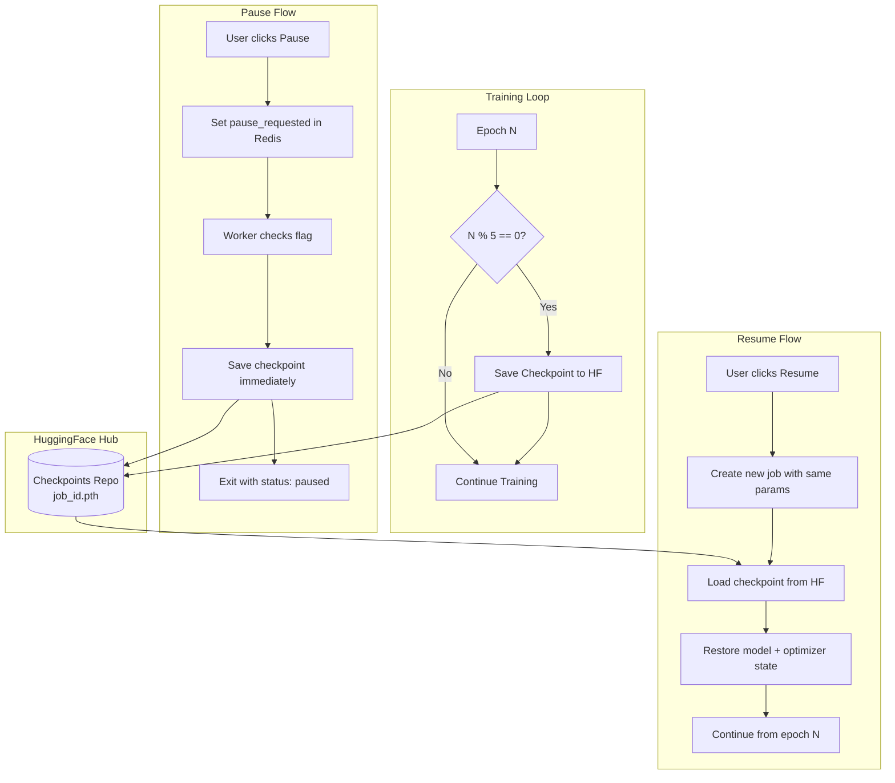

# PyReflect Interface


A minimal, monochrome web interface for the [pyreflect](https://github.com/williamQyq/pyreflect) neutron reflectivity analysis package.

Neutron reflectivity is an experimental technique used to study the internal structure of thin films and layered materials at the nanometer scale, with applications in batteries, semiconductors, polymers, magnetic materials, and surface chemistry. Experiments measure how neutrons reflect off a material, but translating that data into a meaningful depth profile is a difficult inverse problem that traditionally requires expert knowledge and slow, manual fitting. pyreflect uses machine learning to automate and accelerate this process by learning the relationship between measured reflectivity curves and underlying material structure. This interface makes that capability accessible and interactive, enabling faster analysis, easier exploration of material behavior, and quicker real-world scientific and engineering decisions.

Full documentation here: https://deepwiki.com/Northeastern-Research-ORNL-1/pyreflect-interface/5-storage-and-persistence 


## Version

- **v0.1.2** 01/21/2026 — Model bundles (.npy + .pth) on HuggingFace, pipeline documentation, production hardening + whitelist-only higher limits, checkpoints, and controls.
- **v0.1.1** 01/14/2026 — GitHub auth, explore/history sidebar, download bundle support, and GPU compute.

## PyReflect Parameter Parity Roadmap

This interface aims to fully expose all parameters from the [pyreflect](https://github.com/williamQyq/pyreflect) package, making them adjustable through the UI without requiring users to dig into the code.

### Current Coverage

| Category | Exposed | Total | Coverage |
|----------|---------|-------|----------|
| Film Layer Properties | 4 | 4 | ✅ 100% |
| Generator Settings | 3 | 8 | 🔶 38% |
| CNN Training | 4 | 7 | 🔶 57% |
| AE/MLP (Chi Prediction) | 3 | 5 | 🔶 60% |
| **Overall** | **14** | **24** | **58%** |

### Exposed Parameters

| Parameter | Location | Default | Notes |
|-----------|----------|---------|-------|
| `sld` | Film Layer | varies | Scattering Length Density (0–10) |
| `isld` | Film Layer | 0 | Imaginary SLD (0–1) |
| `thickness` | Film Layer | varies | Layer thickness in Å (0–1000) |
| `roughness` | Film Layer | varies | Interface roughness in Å (0–200) |
| `numCurves` | Generator | 1000 | Number of synthetic curves |
| `numFilmLayers` | Generator | 5 | Number of material layers |
| `layerBound` | Generator | — | Per-layer min/max bounds |
| `batchSize` | Training | 32 | CNN training batch size |
| `epochs` | Training | 10 | CNN training epochs |
| `layers` | Training | 12 | CNN convolutional layers |
| `dropout` | Training | 0.0 | CNN dropout rate |
| `latentDim` | Training | 16 | Autoencoder latent dimension |
| `aeEpochs` | Training | 50 | Autoencoder training epochs |
| `mlpEpochs` | Training | 50 | MLP training epochs |

### Implementation Phases

#### Phase 1: Physics Parameters (Reflectivity Calculation)
> These parameters directly affect the physics simulation via refl1d.

- [ ] `qResolution` — Beam Q resolution (default: 0.0294855)
- [ ] `qMin` — Minimum Q value (default: 0.0081 Å⁻¹)
- [ ] `qMax` — Maximum Q value (default: 0.1975 Å⁻¹)
- [ ] `numQPoints` — Number of Q points (default: 308)
- [ ] `scale` — Overall intensity scale factor (default: 1.0)
- [ ] `background` — Background signal level (default: 0.0)

#### Phase 2: Training Configuration
> Common ML hyperparameters most researchers want to tune.

- [ ] `learningRate` — Optimizer learning rate (default: 0.001)
- [ ] `validationSplit` — Train/validation split ratio (default: 0.2)
- [ ] `optimizer` — Optimizer type: Adam, AdamW, SGD (default: Adam)

#### Phase 3: Model Architecture (Advanced)
> Architecture parameters for power users; exposed in an "Advanced" panel.

- [ ] `kernelSize` — CNN Conv1d kernel size (default: 51)
- [ ] `sldOutputPoints` — SLD profile output resolution (default: 900)
- [ ] `vaeBeta` — VAE KL divergence weight (0 = AE, >0 = VAE)
- [ ] `aeHiddenLayers` — Autoencoder hidden layer sizes (default: [500, 300, 200, 72])

#### Phase 4: Preprocessing & Normalization
> Data preprocessing options for experimental workflows.

- [ ] `applyLogTransform` — Log10 transform NR y-axis (default: true)
- [ ] `normalizationMethod` — 'minmax' or 'zscore' (default: minmax)
- [ ] `clipMin` — Minimum clip value for log transform (default: 1e-8)

### Progress Log

| Date | Phase | Changes |
|------|-------|---------|
| 2026-01-26 | — | Initial roadmap created |
| — | Phase 1 | _pending_ |
| — | Phase 2 | _pending_ |
| — | Phase 3 | _pending_ |
| — | Phase 4 | _pending_ |

## Live Deployment

- App: `https://pyreflect.shlawg.com`
- API: `https://api.shlawg.com`

The hosted deployment runs with the full stack enabled: Redis job queue + Modal GPU burst workers, MongoDB history persistence, and Hugging Face model storage.

## Pipelines

> See [docs/FLOW.md](docs/FLOW.md) for a detailed pipeline diagram.

## Features

- **Adjustable Parameters**: Film layers (SLD, thickness, roughness), generator settings, training configuration
- **Manual Layer Bounds**: Set min/max variation ranges per layer parameter for synthetic data generation (notebook-parity `layer_bound` support)
- **Ground Truth vs Predicted**: NR and SLD charts show both ground truth and model predictions
- **Graph Visualization**: Downloadable & interactive NR curves, SLD profiles, training loss, Chi parameter plots
- **Real-time Updates**: Instant parameter feedback with generate-on-demand
- **Editable Values**: Click any numeric value to type custom inputs beyond slider limits
- **Live Streaming Logs**: Real-time training progress streamed from backend via SSE
- **Timing + Warnings**: Generation/training/inference timings and backend warnings streamed to console
- **Data Upload**: Drag-and-drop upload for `.npy` datasets and `.pth` model weights
- **Background Jobs**: Redis + RQ queue for non-blocking training runs
- **Controls**: Buttons for stop, cancel, resume, pause, download, etc. for each job.
- **GPU Training**: Modal GPU burst workers (spin up on demand, scale to zero)
- **Checkpointing**: Periodic checkpoint saves to HuggingFace for crash recovery and pause/resume
- **Cloud Storage**: Hugging Face model artifacts + MongoDB history persistence
- **State Persistence**: Parameters and results persist across browser refreshes
- **Reset + Collapse**: One-click reset to example defaults and per-layer collapse/expand controls

### Limits

| Parameter     | Local   | Production |
| ------------- | ------- | ---------- |
| Curves        | 100,000 | 5,000      |
| Epochs        | 1,000   | 50         |
| Batch Size    | 512     | 64         |
| CNN Layers    | 20      | 12         |
| Dropout       | 0.9     | 0.5        |
| Latent Dim    | 128     | 32         |
| AE/MLP Epochs | 500     | 100        |

Higher limits in production are **allowlist-only**.

- The frontend sends `X-User-ID` as your GitHub username (login).
- The backend uses `LIMITS_WHITELIST_USER_IDS` (comma-separated GitHub usernames) to decide who gets local/unlimited limits.
- If you are not allowlisted, the UI shows a lock icon and the Limits modal provides contact info.

## Project Structure

```
pyreflect-interface/
├── src/
│   ├── interface/          # Next.js frontend
│   └── backend/            # FastAPI backend
│       ├── main.py         # API server
│       ├── settings.yml    # Config (auto-generated)
│       └── data/           # Uploaded datasets & models
│           └── curves/     # NR/SLD curve files
└── README.md
```

> **Note**: The `pyreflect` package is installed directly from [GitHub](https://github.com/williamQyq/pyreflect) rather than bundled in this repo.

### Model Storage Structure

Each training run creates a folder on HuggingFace with all artifacts bundled together:

```
models/{model_id}/
├── {model_id}.pth     # Trained CNN model weights
├── nr_train.npy       # NR curves (N × 2 × 308)
└── sld_train.npy      # SLD profiles (N × 2 × 900)
```

> Object Storage: `https://huggingface.co/datasets/Northeastern-Research-ORNL-1/models/tree/main`

The `.npy` training data files are uploaded immediately after data generation (before training begins). This ensures:

1.  **Fault Tolerance**: If training fails (e.g., OOM, timeout), the generated data is preserved.
2.  **Retry Efficiency**: Retries can reuse the existing `.npy` files instead of regenerating them.
3.  **Data Reuse**: Datasets can be downloaded and shared between team members or used for external analysis.

## Architecture

### System Overview

#### Frontend Layer



#### Backend & Queue Layer



#### External Services



### Data Flow & Training Pipeline

For detailed diagrams of the data generation, preprocessing, training, model saving, and inference phases, see [docs/FLOW.md](docs/FLOW.md).

#### Data Sources

| Field             | Source | Description                                              |
| ----------------- | ------ | -------------------------------------------------------- |
| `nr.groundTruth`  | refl1d | True reflectivity from physics simulation                |
| `nr.computed`     | refl1d | Same as groundTruth (future: compute from predicted SLD) |
| `sld.groundTruth` | refl1d | True SLD profile from physics simulation                 |
| `sld.predicted`   | CNN    | Model prediction given the NR curve as input             |

## API Endpoints

### Core Endpoints

| Endpoint        | Method | Description                    |
| --------------- | ------ | ------------------------------ |
| `/api/health`   | GET    | Health check                   |
| `/api/limits`   | GET    | Current limits + access status |
| `/api/defaults` | GET    | Default parameters             |
| `/api/status`   | GET    | Backend status and data files  |

### Generation

| Endpoint               | Method | Description                            |
| ---------------------- | ------ | -------------------------------------- |
| `/api/generate`        | POST   | Generate NR/SLD curves (non-streaming) |
| `/api/generate/stream` | POST   | Generate with SSE log stream           |

### History

| Endpoint            | Method | Description                             |
| ------------------- | ------ | --------------------------------------- |
| `/api/history`      | GET    | List saved generations                  |
| `/api/history`      | POST   | Save a generation manually              |
| `/api/history/{id}` | GET    | Get full details of a save              |
| `/api/history/{id}` | PATCH  | Rename a saved generation               |
| `/api/history/{id}` | DELETE | Delete a saved generation and its model |

### Models

| Endpoint                      | Method | Description                      |
| ----------------------------- | ------ | -------------------------------- |
| `/api/models/upload`          | POST   | Receive model upload from worker |
| `/api/models/{model_id}`      | GET    | Download a saved model           |
| `/api/models/{model_id}`      | DELETE | Delete a local model file        |
| `/api/models/{model_id}/info` | GET    | Get model size and source        |
| `/api/upload`                 | POST   | Upload files (+ optional roles)  |

### Jobs

| Endpoint                         | Method | Description                            |
| -------------------------------- | ------ | -------------------------------------- |
| `/api/jobs/submit`               | POST   | Submit job to queue (non-blocking)     |
| `/api/jobs/{job_id}`             | GET    | Get job status, progress, and result   |
| `/api/jobs/{job_id}`             | DELETE | Cancel a queued job                    |
| `/api/jobs/{job_id}/name`        | PATCH  | Rename a queued job                    |
| `/api/jobs/{job_id}/retry`       | POST   | Retry a failed/finished job            |
| `/api/jobs/{job_id}/stop`        | POST   | Stop job immediately (no checkpoint)   |
| `/api/jobs/{job_id}/pause`       | POST   | Pause job and save checkpoint          |
| `/api/jobs/{job_id}/delete`      | DELETE | Delete a job record (non-running only) |
| `/api/jobs/{job_id}/claim`       | POST   | Attach a job to a user (login mid-run) |
| `/api/jobs/purge`                | DELETE | Delete non-running jobs for a user     |
| `/api/jobs/{job_id}/force-purge` | POST   | Force purge a zombie job (admin)       |

### Checkpoints

| Endpoint                           | Method | Description                     |
| ---------------------------------- | ------ | ------------------------------- |
| `/api/checkpoints`                 | GET    | List all available checkpoints  |
| `/api/checkpoints/{job_id}/resume` | POST   | Resume training from checkpoint |
| `/api/checkpoints/{job_id}`        | DELETE | Delete a checkpoint             |

### Queue

| Endpoint             | Method | Description                         |
| -------------------- | ------ | ----------------------------------- |
| `/api/queue`         | GET    | Queue status and worker info        |
| `/api/queue/spawn`   | POST   | Trigger remote worker spawn (debug) |
| `/api/queue/cleanup` | POST   | Trigger stale job cleanup (admin)   |

## Job Lifecycle

### Zombie Prevention

The system includes automatic detection and cleanup of "zombie" jobs - jobs that get stuck in "started" state when their worker dies unexpectedly (Modal container killed, OOM, heartbeat timeout, etc.).



Workers update `job.meta.updated_at` every ~1 second during execution. The stale job detector:

1. Scans the started registry (`rq:wip:training`, `rq:started:training`)
2. Checks each job's `meta.updated_at` timestamp
3. If older than `STALE_JOB_THRESHOLD_S` (default: 600 seconds / 10 minutes), marks it as stale
4. Purges stale jobs from Redis registries and marks them as failed

| Environment Variable           | Default | Description                              |
| ------------------------------ | ------- | ---------------------------------------- |
| `STALE_JOB_THRESHOLD_S`        | 600     | Seconds before a job is considered stale |
| `STALE_JOB_CLEANUP_INTERVAL_S` | 60      | How often the cleanup task runs          |

Manual cleanup (admin only):

```bash
# Dry-run: see what would be cleaned
curl -X POST "http://localhost:8000/api/queue/cleanup?dry_run=true" \
  -H "X-Admin-Token: YOUR_ADMIN_TOKEN"

# Actually clean up stale jobs
curl -X POST "http://localhost:8000/api/queue/cleanup" \
  -H "X-Admin-Token: YOUR_ADMIN_TOKEN"

# Force purge a specific job
curl -X POST "http://localhost:8000/api/jobs/JOB_ID/force-purge" \
  -H "X-Admin-Token: YOUR_ADMIN_TOKEN"
```

### Graceful Stop

The `/api/jobs/{job_id}/stop` endpoint:

1. Sets `meta.stop_requested = true` (checked by worker between phases/epochs)
2. Sends RQ `stop-job` command to kill the workhorse process immediately
3. Removes job from queue/started registries
4. Updates meta to show "stopped" status in UI

This handles both graceful stops (worker sees flag) and hard stops (worker process killed).

### Checkpointing & Resume

Training jobs can be paused and resumed across worker restarts or crashes. Checkpoints are stored on HuggingFace Hub in a dedicated dataset repo.



Each checkpoint (`{job_id}.pth`) contains:

| Field                   | Description                           |
| ----------------------- | ------------------------------------- |
| `epoch`                 | Last completed epoch number           |
| `model_state_dict`      | Full model weights                    |
| `optimizer_state_dict`  | Optimizer state (Adam momentum, etc.) |
| `train_losses`          | Training loss history                 |
| `val_losses`            | Validation loss history               |
| `best_val_loss`         | Best validation loss seen             |
| `nr_stats`, `sld_stats` | Normalization statistics              |

**Pause vs Stop:**

| Action    | Saves Checkpoint? | Can Resume? | Use Case               |
| --------- | ----------------- | ----------- | ---------------------- |
| **Pause** | Yes               | Yes         | Want to continue later |
| **Stop**  | No                | No          | Abandon training       |

**Configuration:**

| Environment Variable        | Default | Description                              |
| --------------------------- | ------- | ---------------------------------------- |
| `CHECKPOINT_EVERY_N_EPOCHS` | 5       | Save checkpoint every N epochs           |
| `HF_CHECKPOINT_REPO_ID`     | -       | HuggingFace dataset repo for checkpoints |

The checkpoint repo should be a HuggingFace **dataset** type repo (e.g., `org/checkpoints`).

- **Frontend**: Next.js 16, React 19, TypeScript, Recharts
- **Backend**: FastAPI, Pydantic, NumPy
- **ML Package**: pyreflect (PyTorch, refl1d, refnx)

## Credits

- [pyreflect](https://github.com/williamQyq/pyreflect) - NR-SCFT-ML package by Yuqing Qiao
- Based on research by Brian Qu, Dr. Rajeev Kumar, Prof. Miguel Fuentes-Cabrera
