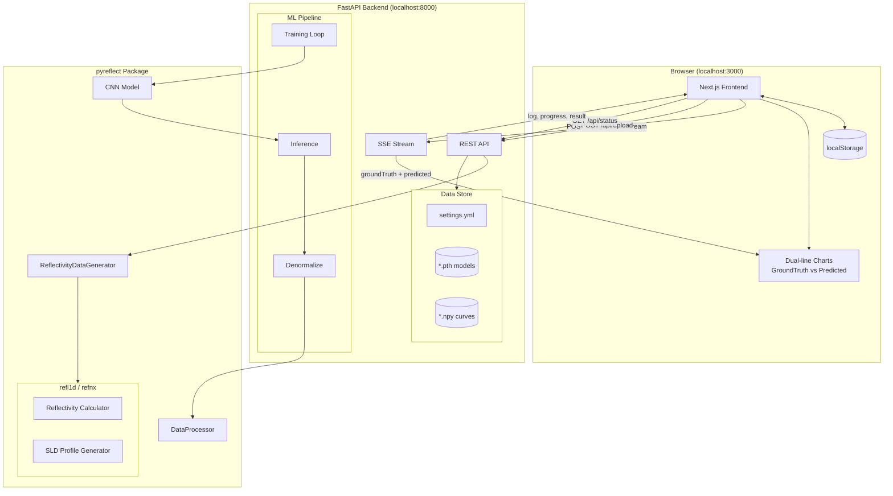
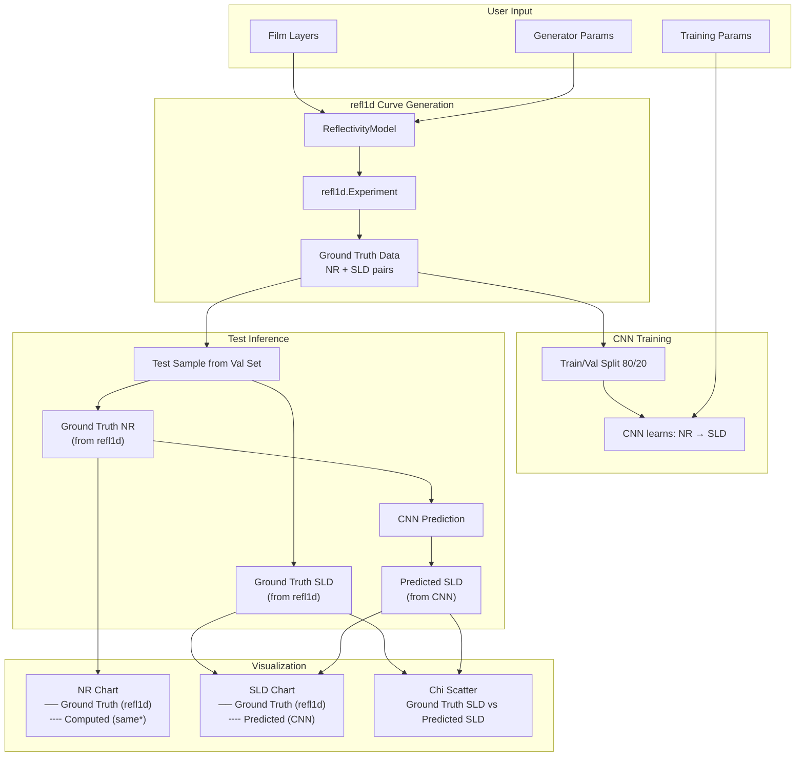
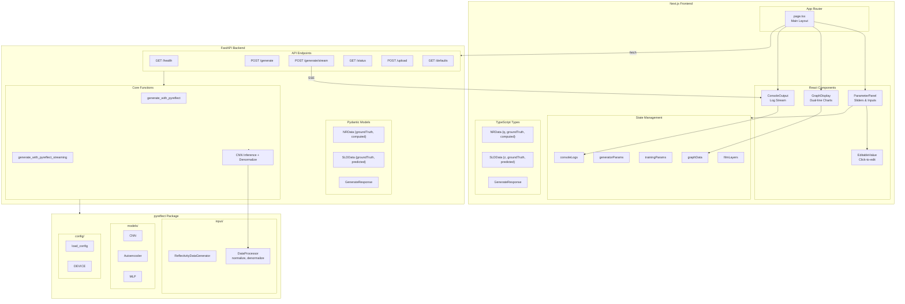
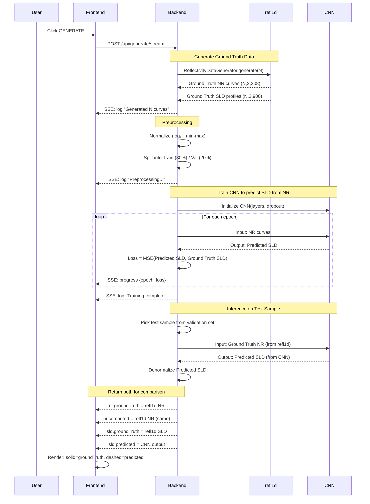

# PyReflect Interface

A minimal, monochrome web interface for the [pyreflect](https://github.com/williamQyq/pyreflect) neutron reflectivity analysis package and its local copy in this repo.


## Version

- **v0.0.1** — Initial GUI release with streaming backend, charts, and uploads.
- **NOTE** — Curve set to 1000 default globally 

## Features

- **Adjustable Parameters**: Film layers (SLD, thickness, roughness), generator settings, training configuration
- **Ground Truth vs Predicted**: NR and SLD charts show both ground truth (solid) and model predictions (dashed)
- **Graph Visualization**: Downloadable & interactive NR curves, SLD profiles, training loss, Chi parameter scatter plots
- **Monochrome Design**: Clean black/white aesthetic with JetBrains Mono font
- **Real-time Updates**: Instant parameter feedback with generate-on-demand
- **Editable Values**: Click any numeric value to type custom inputs beyond slider limits
- **Live Streaming Logs**: Real-time training progress streamed from backend via SSE
- **Timing + Warnings**: Generation/training/inference timings and backend warnings streamed to console
- **Data Upload**: Drag-and-drop upload for `.npy` datasets and `.pth` model weights
- **State Persistence**: Parameters and results persist across browser refreshes
- **Reset + Collapse**: One-click reset to example defaults and per-layer collapse/expand controls

## Project Structure

```
pyreflect-interface/
├── src/
│   ├── interface/          # Next.js frontend
│   └── backend/            # FastAPI backend
│       ├── main.py         # API server
│       ├── settings.yml    # Config (auto-generated)
│       └── data/           # Uploaded datasets & models
│           └── curves/     # NR/SLD curve files
└── README.md
```

> **Note**: The `pyreflect` package is installed from [TestPyPI](https://test.pypi.org/project/pyreflect/) rather than bundled in this repo.

## Architecture

### System Overview



### Data Flow



#### Data Sources

| Field | Source | Description |
|-------|--------|-------------|
| `nr.groundTruth` | refl1d | True reflectivity from physics simulation |
| `nr.computed` | refl1d | Same as groundTruth (future: compute from predicted SLD) |
| `sld.groundTruth` | refl1d | True SLD profile from physics simulation |
| `sld.predicted` | CNN | Model prediction given the NR curve as input |

### Component Architecture



### Training Pipeline



## Quick Start

### Prerequisites

- Node.js 18+
- Python 3.10+
- npm or yarn

### 1. Frontend Setup

```bash
cd src/interface
npm install
npm run dev
```

Open **http://localhost:3000** in your browser.

### 2. Backend Setup (Optional)

The frontend requires the backend for real generation. If the backend is not running, the UI will show **Backend not deployed**.

```bash
cd src/backend
python -m venv .venv
source .venv/bin/activate  # On Windows: .venv\Scripts\activate

# Install pyreflect from TestPyPI (+ other deps from PyPI)
pip install -i https://test.pypi.org/simple/ --extra-index-url https://pypi.org/simple pyreflect>=1.4.0
pip install -r requirements.txt

uvicorn main:app --port 8000
```

Backend runs at **http://localhost:8000**

**Troubleshooting:**

```bash
# Kill process on port 8000 (if address already in use)
lsof -ti:8000 | xargs kill -9

# Kill process on port 3000
lsof -ti:3000 | xargs kill -9
```

### 3. Using the Interface

1. Adjust parameters in the left sidebar:

   - **Film Layers**: Add/remove layers, adjust SLD, thickness, roughness
   - **Generator**: Set number of curves and layers
   - **Training**: Configure batch size, epochs, dropout, etc.

2. Click **GENERATE** to compute and visualize:
   - **NR Chart**: Ground truth (solid) vs Computed (dashed)
   - **SLD Profile**: Ground truth (solid black) vs Predicted (dashed red)
   - **Training Loss**: Training and validation loss curves
   - **Chi Parameters**: Scatter plot of actual vs predicted SLD values

3. **Tips**:
   - Click any numeric value to type a custom number (e.g., 50000 curves)
   - Watch the console for real-time training progress, warnings, and timing
   - Use **RESET** to restore the example defaults
   - Use **COLLAPSE/EXPAND** to manage long film layer lists
   - Export individual graphs as CSV or all data as JSON
   - Charts show model predictions compared to ground truth after training

### 4. Uploading Data Files (Optional)

For pretrained models or existing datasets, use the **Data & Models** section:

```
Supported files:
├── *.npy          → Saved to src/backend/data/curves/
├── *.pth, *.pt    → Saved to src/backend/data/
└── settings.yml   → Saved to src/backend/
```

Files from `pyreflect/datasets/` can be uploaded:
- `normalization_stat.npy` - Normalization statistics
- `trained_nr_sld_model_no_dropout.pth` - Pretrained CNN model
- `X_train_5_layers.npy`, `y_train_5_layers.npy` - Training data

## API Endpoints

| Endpoint               | Method | Description                              |
| ---------------------- | ------ | ---------------------------------------- |
| `/api/health`          | GET    | Health check                             |
| `/api/generate`        | POST   | Generate NR/SLD curves                   |
| `/api/generate/stream` | POST   | Generate with real-time SSE log stream   |
| `/api/defaults`        | GET    | Get default parameters                   |
| `/api/status`          | GET    | Backend status and available data files  |
| `/api/upload`          | POST   | Upload dataset/model files               |

## Technology Stack

- **Frontend**: Next.js 16, React 19, TypeScript, Recharts
- **Backend**: FastAPI, Pydantic, NumPy
- **ML Package**: pyreflect (PyTorch, refl1d, refnx)

## Development

```bash
# Frontend development
cd src/interface
npm run dev

# Backend development
cd src/backend
uvicorn main:app --reload

# Build for production
cd src/interface
npm run build
```

## Credits

- [pyreflect](https://github.com/williamQyq/pyreflect) - NR-SCFT-ML package by Yuqing Qiao
- Based on research by Brian Qu, Dr. Rajeev Kumar, Prof. Miguel Fuentes-Cabrera
