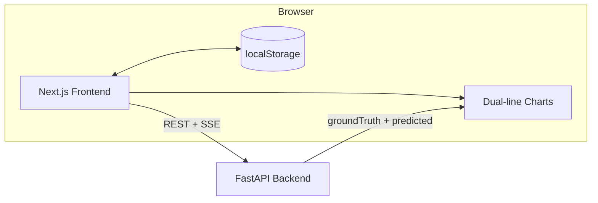
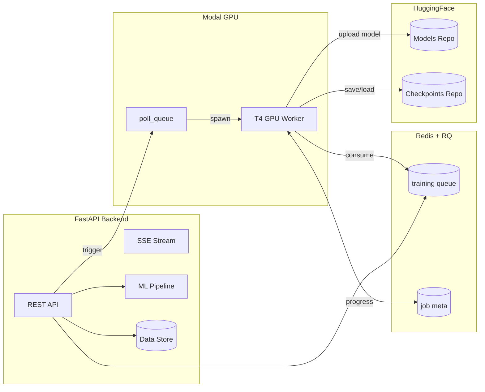
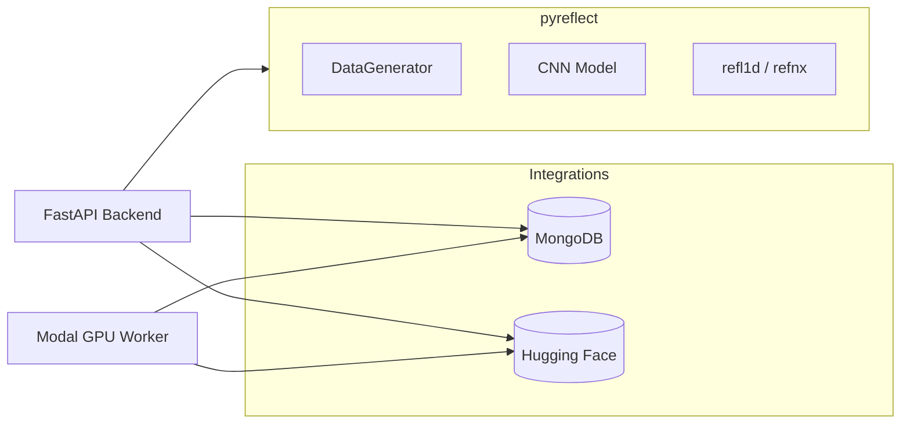
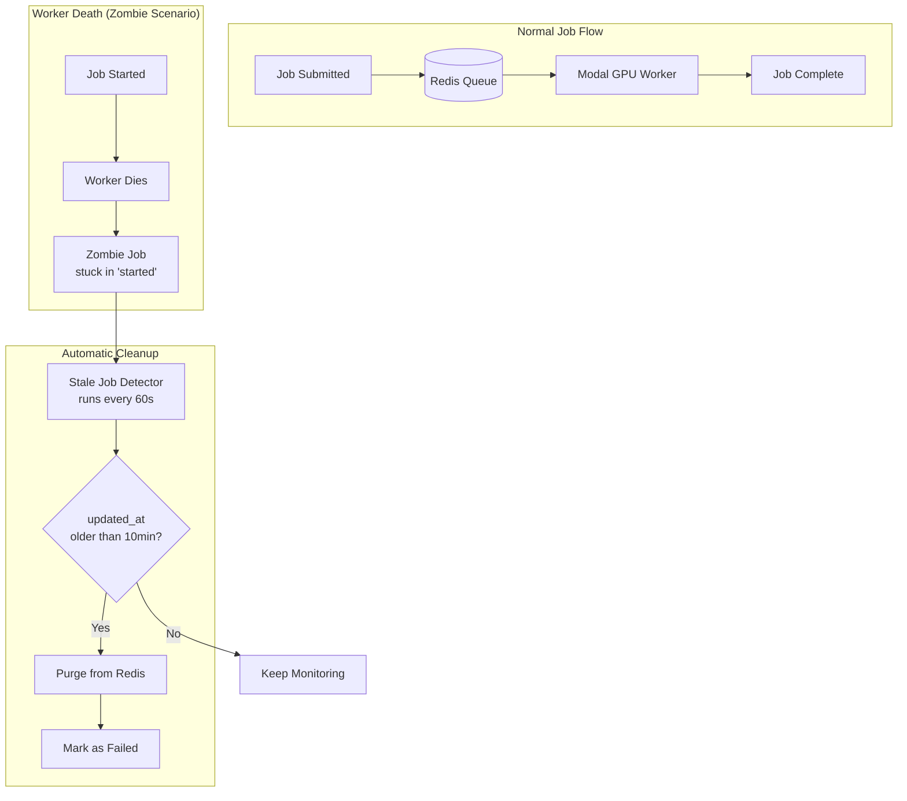
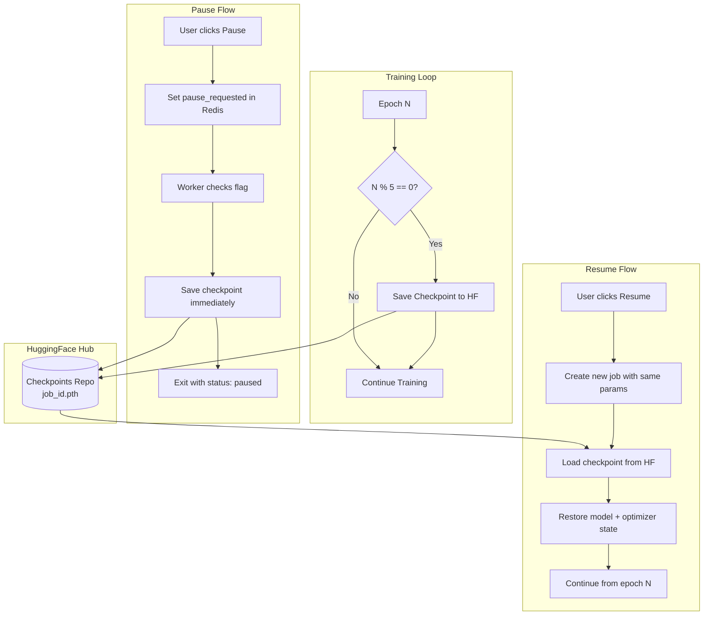

# PyReflect Interface


A minimal, monochrome web interface for the [pyreflect](https://github.com/williamQyq/pyreflect) neutron reflectivity analysis package.

Neutron reflectivity is an experimental technique used to study the internal structure of thin films and layered materials at the nanometer scale, with applications in batteries, semiconductors, polymers, magnetic materials, and surface chemistry. Experiments measure how neutrons reflect off a material, but translating that data into a meaningful depth profile is a difficult inverse problem that traditionally requires expert knowledge and slow, manual fitting. pyreflect uses machine learning to automate and accelerate this process by learning the relationship between measured reflectivity curves and underlying material structure. This interface makes that capability accessible and interactive, enabling faster analysis, easier exploration of material behavior, and quicker real-world scientific and engineering decisions.

Full documentation here: https://deepwiki.com/Northeastern-Research-ORNL-1/pyreflect-interface/5-storage-and-persistence


## Version

- **v0.1.2** 01/21/2026 — Model bundles (.npy + .pth) on HuggingFace, pipeline documentation, production hardening + whitelist-only higher limits, checkpoints, and controls.
- **v0.1.1** 01/14/2026 — GitHub auth, explore/history sidebar, download bundle support, and GPU compute.

## PyReflect Parameter Parity Roadmap

This interface aims to fully expose all parameters from the [pyreflect](https://github.com/williamQyq/pyreflect) package, making them adjustable through the UI without requiring users to dig into the code.

### Current Coverage

| Category                | Exposed | Total  | Coverage |
| ----------------------- | ------- | ------ | -------- |
| Film Layer Properties   | 4       | 4      | ✅ 100%  |
| Generator Settings      | 3       | 8      | 🔶 38%   |
| CNN Training            | 4       | 7      | 🔶 57%   |
| AE/MLP (Chi Prediction) | 3       | 5      | 🔶 60%   |
| **Overall**             | **14**  | **24** | **58%**  |

### Exposed Parameters

| Parameter       | Location   | Default | Notes                            |
| --------------- | ---------- | ------- | -------------------------------- |
| `sld`           | Film Layer | varies  | Scattering Length Density (0–10) |
| `isld`          | Film Layer | 0       | Imaginary SLD (0–1)              |
| `thickness`     | Film Layer | varies  | Layer thickness in Å (0–1000)    |
| `roughness`     | Film Layer | varies  | Interface roughness in Å (0–200) |
| `numCurves`     | Generator  | 1000    | Number of synthetic curves       |
| `numFilmLayers` | Generator  | 5       | Number of material layers        |
| `layerBound`    | Generator  | —       | Per-layer min/max bounds         |
| `batchSize`     | Training   | 32      | CNN training batch size          |
| `epochs`        | Training   | 10      | CNN training epochs              |
| `layers`        | Training   | 12      | CNN convolutional layers         |
| `dropout`       | Training   | 0.0     | CNN dropout rate                 |
| `latentDim`     | Training   | 16      | Autoencoder latent dimension     |
| `aeEpochs`      | Training   | 50      | Autoencoder training epochs      |
| `mlpEpochs`     | Training   | 50      | MLP training epochs              |

### Implementation Phases

#### Phase 1: Physics Parameters (Reflectivity Calculation)

> These parameters directly affect the physics simulation via refl1d.

- [ ] `qResolution` — Beam Q resolution (default: 0.0294855)
- [ ] `qMin` — Minimum Q value (default: 0.0081 Å⁻¹)
- [ ] `qMax` — Maximum Q value (default: 0.1975 Å⁻¹)
- [ ] `numQPoints` — Number of Q points (default: 308)
- [ ] `scale` — Overall intensity scale factor (default: 1.0)
- [ ] `background` — Background signal level (default: 0.0)

#### Phase 2: Training Configuration

> Common ML hyperparameters most researchers want to tune.

- [ ] `learningRate` — Optimizer learning rate (default: 0.001)
- [ ] `validationSplit` — Train/validation split ratio (default: 0.2)
- [ ] `optimizer` — Optimizer type: Adam, AdamW, SGD (default: Adam)

#### Phase 3: Model Architecture (Advanced)

> Architecture parameters for power users; exposed in an "Advanced" panel.

- [ ] `kernelSize` — CNN Conv1d kernel size (default: 51)
- [ ] `sldOutputPoints` — SLD profile output resolution (default: 900)
- [ ] `vaeBeta` — VAE KL divergence weight (0 = AE, >0 = VAE)
- [ ] `aeHiddenLayers` — Autoencoder hidden layer sizes (default: [500, 300, 200, 72])

#### Phase 4: Preprocessing & Normalization

> Data preprocessing options for experimental workflows.

- [ ] `applyLogTransform` — Log10 transform NR y-axis (default: true)
- [ ] `normalizationMethod` — 'minmax' or 'zscore' (default: minmax)
- [ ] `clipMin` — Minimum clip value for log transform (default: 1e-8)

### Progress Log

| Date       | Phase   | Changes                 |
| ---------- | ------- | ----------------------- |
| 2026-01-26 | —       | Initial roadmap created |
| —          | Phase 1 | _pending_               |
| —          | Phase 2 | _pending_               |
| —          | Phase 3 | _pending_               |
| —          | Phase 4 | _pending_               |

## Live Deployment

- App: `https://pyreflect.shlawg.com`
- API: `https://api.shlawg.com`

The hosted deployment runs with the full stack enabled: Redis job queue + Modal GPU burst workers, MongoDB history persistence, and Hugging Face model storage.

## Pipelines

> See [docs/FLOW.md](docs/FLOW.md) for a detailed pipeline diagram.

## Features

- **Adjustable Parameters**: Film layers (SLD, thickness, roughness), generator settings, training configuration
- **Manual Layer Bounds**: Set min/max variation ranges per layer parameter for synthetic data generation (notebook-parity `layer_bound` support)
- **Ground Truth vs Predicted**: NR and SLD charts show both ground truth and model predictions
- **Graph Visualization**: Downloadable & interactive NR curves, SLD profiles, training loss, Chi parameter plots
- **Real-time Updates**: Instant parameter feedback with generate-on-demand
- **Editable Values**: Click any numeric value to type custom inputs beyond slider limits
- **Live Streaming Logs**: Real-time training progress streamed from backend via SSE
- **Timing + Warnings**: Generation/training/inference timings and backend warnings streamed to console
- **Data Upload**: Drag-and-drop upload for `.npy` datasets and `.pth` model weights
- **Background Jobs**: Redis + RQ queue for non-blocking training runs
- **Controls**: Buttons for stop, cancel, resume, pause, download, etc. for each job.
- **GPU Training**: Modal GPU burst workers (spin up on demand, scale to zero)
- **Checkpointing**: Periodic checkpoint saves to HuggingFace for crash recovery and pause/resume
- **Cloud Storage**: Hugging Face model artifacts + MongoDB history persistence
- **State Persistence**: Parameters and results persist across browser refreshes
- **Reset + Collapse**: One-click reset to example defaults and per-layer collapse/expand controls

### Limits

| Parameter     | Local   | Production |
| ------------- | ------- | ---------- |
| Curves        | 100,000 | 5,000      |
| Epochs        | 1,000   | 50         |
| Batch Size    | 512     | 64         |
| CNN Layers    | 20      | 12         |
| Dropout       | 0.9     | 0.5        |
| Latent Dim    | 128     | 32         |
| AE/MLP Epochs | 500     | 100        |

Higher limits in production are **allowlist-only**.

- The frontend sends `X-User-ID` as your GitHub username (login).
- The backend uses `LIMITS_WHITELIST_USER_IDS` (comma-separated GitHub usernames) to decide who gets local/unlimited limits.
- If you are not allowlisted, the UI shows a lock icon and the Limits modal provides contact info.

## Project Structure

```
pyreflect-interface/
├── src/
│   ├── interface/          # Next.js frontend
│   └── backend/            # FastAPI backend
│       ├── main.py         # API server
│       ├── settings.yml    # Config (auto-generated)
│       └── data/           # Uploaded datasets & models
│           └── curves/     # NR/SLD curve files
└── README.md
```

> **Note**: The `pyreflect` package is installed directly from [GitHub](https://github.com/williamQyq/pyreflect) rather than bundled in this repo.

### Model Storage Structure

Each training run creates a folder on HuggingFace with all artifacts bundled together:

```
models/{model_id}/
├── {model_id}.pth     # Trained CNN model weights
├── nr_train.npy       # NR curves (N × 2 × 308)
└── sld_train.npy      # SLD profiles (N × 2 × 900)
```

> Object Storage: `https://huggingface.co/datasets/Northeastern-Research-ORNL-1/models/tree/main`

The `.npy` training data files are uploaded immediately after data generation (before training begins). This ensures:

1.  **Fault Tolerance**: If training fails (e.g., OOM, timeout), the generated data is preserved.
2.  **Retry Efficiency**: Retries can reuse the existing `.npy` files instead of regenerating them.
3.  **Data Reuse**: Datasets can be downloaded and shared between team members or used for external analysis.

## Architecture

### System Overview

#### Frontend Layer


```mermaid
flowchart LR
    subgraph Browser["Browser"]
        UI[Next.js Frontend]
        Charts["Dual-line Charts"]
        LS[(localStorage)]
    end

    UI <--> LS
    UI --> Charts
    UI -->|REST + SSE| API[FastAPI Backend]
    API -->|groundTruth + predicted| Charts
```

#### Backend & Queue Layer


```mermaid
flowchart LR
    subgraph Backend["FastAPI Backend"]
        API[REST API]
        SSE[SSE Stream]
        Pipeline[ML Pipeline]
        DataStore[(Data Store)]
    end

    subgraph Queue["Redis + RQ"]
        RQ[(training queue)]
        Meta[(job meta)]
    end

    subgraph Modal["Modal GPU"]
        Poller[poll_queue]
        Worker[T4 GPU Worker]
    end

    subgraph Checkpoints["HuggingFace"]
        HFModels[(Models Repo)]
        HFCheckpoints[(Checkpoints Repo)]
    end

    API --> RQ
    API -->|trigger| Poller
    Poller -->|spawn| Worker
    Worker -->|consume| RQ
    Worker -->|save/load| HFCheckpoints
    Worker -->|upload model| HFModels
    Worker <-->|progress| Meta
    API --> Pipeline
    API --> DataStore
```

#### External Services


```mermaid
flowchart LR
    Backend[FastAPI Backend]
    Worker[Modal GPU Worker]

    subgraph Storage["Integrations"]
        Mongo[(MongoDB)]
        HF[(Hugging Face)]
    end

    subgraph PyReflect["pyreflect"]
        Gen[DataGenerator]
        CNN[CNN Model]
        Physics[refl1d / refnx]
    end

    Backend --> Mongo
    Backend --> HF
    Worker --> Mongo
    Worker --> HF
    Backend --> PyReflect
```

### Data Flow & Training Pipeline

For detailed diagrams of the data generation, preprocessing, training, model saving, and inference phases, see [docs/FLOW.md](docs/FLOW.md).

#### Data Sources

| Field             | Source | Description                                              |
| ----------------- | ------ | -------------------------------------------------------- |
| `nr.groundTruth`  | refl1d | True reflectivity from physics simulation                |
| `nr.computed`     | refl1d | Same as groundTruth (future: compute from predicted SLD) |
| `sld.groundTruth` | refl1d | True SLD profile from physics simulation                 |
| `sld.predicted`   | CNN    | Model prediction given the NR curve as input             |

## API Endpoints

### Core Endpoints

| Endpoint        | Method | Description                    |
| --------------- | ------ | ------------------------------ |
| `/api/health`   | GET    | Health check                   |
| `/api/limits`   | GET    | Current limits + access status |
| `/api/defaults` | GET    | Default parameters             |
| `/api/status`   | GET    | Backend status and data files  |

### Generation

| Endpoint               | Method | Description                            |
| ---------------------- | ------ | -------------------------------------- |
| `/api/generate`        | POST   | Generate NR/SLD curves (non-streaming) |
| `/api/generate/stream` | POST   | Generate with SSE log stream           |

### History

| Endpoint            | Method | Description                             |
| ------------------- | ------ | --------------------------------------- |
| `/api/history`      | GET    | List saved generations                  |
| `/api/history`      | POST   | Save a generation manually              |
| `/api/history/{id}` | GET    | Get full details of a save              |
| `/api/history/{id}` | PATCH  | Rename a saved generation               |
| `/api/history/{id}` | DELETE | Delete a saved generation and its model |

### Models

| Endpoint                      | Method | Description                      |
| ----------------------------- | ------ | -------------------------------- |
| `/api/models/upload`          | POST   | Receive model upload from worker |
| `/api/models/{model_id}`      | GET    | Download a saved model           |
| `/api/models/{model_id}`      | DELETE | Delete a local model file        |
| `/api/models/{model_id}/info` | GET    | Get model size and source        |
| `/api/upload`                 | POST   | Upload files (+ optional roles)  |

### Jobs

| Endpoint                         | Method | Description                            |
| -------------------------------- | ------ | -------------------------------------- |
| `/api/jobs/submit`               | POST   | Submit job to queue (non-blocking)     |
| `/api/jobs/{job_id}`             | GET    | Get job status, progress, and result   |
| `/api/jobs/{job_id}`             | DELETE | Cancel a queued job                    |
| `/api/jobs/{job_id}/name`        | PATCH  | Rename a queued job                    |
| `/api/jobs/{job_id}/retry`       | POST   | Retry a failed/finished job            |
| `/api/jobs/{job_id}/stop`        | POST   | Stop job immediately (no checkpoint)   |
| `/api/jobs/{job_id}/pause`       | POST   | Pause job and save checkpoint          |
| `/api/jobs/{job_id}/delete`      | DELETE | Delete a job record (non-running only) |
| `/api/jobs/{job_id}/claim`       | POST   | Attach a job to a user (login mid-run) |
| `/api/jobs/purge`                | DELETE | Delete non-running jobs for a user     |
| `/api/jobs/{job_id}/force-purge` | POST   | Force purge a zombie job (admin)       |

### Checkpoints

| Endpoint                           | Method | Description                     |
| ---------------------------------- | ------ | ------------------------------- |
| `/api/checkpoints`                 | GET    | List all available checkpoints  |
| `/api/checkpoints/{job_id}/resume` | POST   | Resume training from checkpoint |
| `/api/checkpoints/{job_id}`        | DELETE | Delete a checkpoint             |

### Queue

| Endpoint             | Method | Description                         |
| -------------------- | ------ | ----------------------------------- |
| `/api/queue`         | GET    | Queue status and worker info        |
| `/api/queue/spawn`   | POST   | Trigger remote worker spawn (debug) |
| `/api/queue/cleanup` | POST   | Trigger stale job cleanup (admin)   |

## Job Lifecycle

### Zombie Prevention

The system includes automatic detection and cleanup of "zombie" jobs - jobs that get stuck in "started" state when their worker dies unexpectedly (Modal container killed, OOM, heartbeat timeout, etc.).


```mermaid
flowchart TB
    subgraph Normal["Normal Job Flow"]
        Submit[Job Submitted]
        Queue[(Redis Queue)]
        Worker[Modal GPU Worker]
        Complete[Job Complete]
    end

    subgraph Failure["Worker Death (Zombie Scenario)"]
        Started[Job Started]
        Death[Worker Dies]
        Zombie[Zombie Job<br/>stuck in 'started']
    end

    subgraph Detection["Automatic Cleanup"]
        Cleanup[Stale Job Detector<br/>runs every 60s]
        Check{updated_at<br/>older than 10min?}
        Purge[Purge from Redis]
        MarkFailed[Mark as Failed]
    end

    Submit --> Queue --> Worker --> Complete

    Started --> Death --> Zombie
    Zombie --> Cleanup
    Cleanup --> Check
    Check -->|Yes| Purge --> MarkFailed
    Check -->|No| Wait[Keep Monitoring]
```

Workers update `job.meta.updated_at` every ~1 second during execution. The stale job detector:

1. Scans the started registry (`rq:wip:training`, `rq:started:training`)
2. Checks each job's `meta.updated_at` timestamp
3. If older than `STALE_JOB_THRESHOLD_S` (default: 600 seconds / 10 minutes), marks it as stale
4. Purges stale jobs from Redis registries and marks them as failed

| Environment Variable           | Default | Description                              |
| ------------------------------ | ------- | ---------------------------------------- |
| `STALE_JOB_THRESHOLD_S`        | 600     | Seconds before a job is considered stale |
| `STALE_JOB_CLEANUP_INTERVAL_S` | 60      | How often the cleanup task runs          |

Manual cleanup (admin only):

```bash
# Dry-run: see what would be cleaned
curl -X POST "http://localhost:8000/api/queue/cleanup?dry_run=true" \
  -H "X-Admin-Token: YOUR_ADMIN_TOKEN"

# Actually clean up stale jobs
curl -X POST "http://localhost:8000/api/queue/cleanup" \
  -H "X-Admin-Token: YOUR_ADMIN_TOKEN"

# Force purge a specific job
curl -X POST "http://localhost:8000/api/jobs/JOB_ID/force-purge" \
  -H "X-Admin-Token: YOUR_ADMIN_TOKEN"
```

### Graceful Stop

The `/api/jobs/{job_id}/stop` endpoint:

1. Sets `meta.stop_requested = true` (checked by worker between phases/epochs)
2. Sends RQ `stop-job` command to kill the workhorse process immediately
3. Removes job from queue/started registries
4. Updates meta to show "stopped" status in UI

This handles both graceful stops (worker sees flag) and hard stops (worker process killed).

### Checkpointing & Resume

Training jobs can be paused and resumed across worker restarts or crashes. Checkpoints are stored on HuggingFace Hub in a dedicated dataset repo.


```mermaid
flowchart TB
    subgraph Training["Training Loop"]
        Epoch[Epoch N]
        Check{N % 5 == 0?}
        Save[Save Checkpoint to HF]
        Continue[Continue Training]
    end

    subgraph Pause["Pause Flow"]
        PauseBtn[User clicks Pause]
        SetFlag[Set pause_requested in Redis]
        Worker[Worker checks flag]
        SaveImmediate[Save checkpoint immediately]
        Exit[Exit with status: paused]
    end

    subgraph Resume["Resume Flow"]
        ResumeBtn[User clicks Resume]
        NewJob[Create new job with same params]
        LoadCheckpoint[Load checkpoint from HF]
        RestoreState[Restore model + optimizer state]
        ContinueFrom[Continue from epoch N]
    end

    subgraph Storage["HuggingFace Hub"]
        HFRepo[(Checkpoints Repo<br/>job_id.pth)]
    end

    Epoch --> Check
    Check -->|Yes| Save --> Continue
    Check -->|No| Continue
    Save --> HFRepo

    PauseBtn --> SetFlag --> Worker --> SaveImmediate --> HFRepo
    SaveImmediate --> Exit

    ResumeBtn --> NewJob --> LoadCheckpoint
    HFRepo --> LoadCheckpoint
    LoadCheckpoint --> RestoreState --> ContinueFrom
```

Each checkpoint (`{job_id}.pth`) contains:

| Field                   | Description                           |
| ----------------------- | ------------------------------------- |
| `epoch`                 | Last completed epoch number           |
| `model_state_dict`      | Full model weights                    |
| `optimizer_state_dict`  | Optimizer state (Adam momentum, etc.) |
| `train_losses`          | Training loss history                 |
| `val_losses`            | Validation loss history               |
| `best_val_loss`         | Best validation loss seen             |
| `nr_stats`, `sld_stats` | Normalization statistics              |

**Pause vs Stop:**

| Action    | Saves Checkpoint? | Can Resume? | Use Case               |
| --------- | ----------------- | ----------- | ---------------------- |
| **Pause** | Yes               | Yes         | Want to continue later |
| **Stop**  | No                | No          | Abandon training       |

**Configuration:**

| Environment Variable        | Default | Description                              |
| --------------------------- | ------- | ---------------------------------------- |
| `CHECKPOINT_EVERY_N_EPOCHS` | 5       | Save checkpoint every N epochs           |
| `HF_CHECKPOINT_REPO_ID`     | -       | HuggingFace dataset repo for checkpoints |

The checkpoint repo should be a HuggingFace **dataset** type repo (e.g., `org/checkpoints`).

## Getting Started

### 1. Backend Setup

```bash
cd src/backend
uv sync
uv run uvicorn main:app --reload --port 8000
```

Backend runs at **http://localhost:8000**

### 2. Frontend Setup

```bash
cd src/interface
bun install
bun dev
```

Frontend runs at **http://localhost:3000**

### 3. GPU Worker (Optional - Modal)

For GPU-accelerated training (serverless, pay-per-use), deploy the Modal worker.

Important:

- Your backend must enqueue to a Redis instance reachable from Modal (`REDIS_URL`).
- Disable the backend's local worker so jobs aren't consumed on CPU (`START_LOCAL_RQ_WORKER=false`).
- `REDIS_URL=redis://localhost:6379` will NOT work with Modal (localhost is inside the Modal container).

```bash
cd src/backend

# Install backend + dev deps (includes Modal CLI)
uv sync
# If you still see `modal: command not found`, force-install the dev group:
# uv sync --group dev

# Auth (pick one)
# Option A: browser/OAuth flow
uv run modal setup
#
# Option B: token flow (Modal dashboard -> Settings -> Tokens)
uv run modal token set --token-id <token-id> --token-secret <token-secret>

# Add your Redis secret (must match backend REDIS_URL).
# Modal containers can't read your local `.env`, and you shouldn't bake secrets into the image.
uv run modal secret create --force pyreflect-redis REDIS_URL="redis://:PASSWORD@YOUR_PUBLIC_REDIS_HOST:6379"

# Deploy (cron polls Redis and spawns a GPU RQ worker only when jobs are pending)
uv run modal deploy modal_worker.py
```

The worker automatically:

- Spins up a T4 GPU when jobs are queued
- Runs the same `service.jobs.run_training_job` code as local workers (progress, results, model uploads)
- Scales down when idle (no cost)

**Verify end-to-end:**

- Backend: `GET /api/queue` should show `local_worker_enabled: false` and `remote_workers_compatible: true`.
- When you enqueue a training job, `queued_jobs` should become `> 0` briefly.
- Modal logs should show `pending=<N>` and then `Starting RQ SimpleWorker ... (burst mode)`:

```bash
cd src/backend
uv run modal app logs pyreflect-worker --timestamps
```

**Stop/Undeploy:**

```bash
cd src/backend
uv run modal app stop pyreflect-worker
```

#### Bare-metal Redis (required for Modal)

If your Redis runs on your own machine, **Modal can only reach it if it's reachable from the public internet**.
That usually means your machine has a public IP (or you set up port-forwarding), and Redis is configured to accept
remote connections securely.

Minimum checklist (Redis host):

- Configure Redis to listen on a reachable interface (`bind 0.0.0.0` or your public NIC) and require auth (`requirepass` or ACLs).
- Open firewall / router port-forward for TCP `6379` to the Redis host.
- Confirm connectivity from outside your network: `redis-cli -h <public-host> -a <password> ping` (should return `PONG`).

If you can't safely expose Redis publicly, use a managed Redis (Upstash / Redis Cloud) and point both the backend and Modal at it.

#### Does `modal deploy` run when I start `uvicorn`?

No. `uv run modal deploy ...` deploys the Modal app to Modal's infra and runs independently. Starting `uvicorn` only starts the API server.

#### Why doesn't it "auto-spawn" a GPU on deploy?

`modal deploy` registers your functions + schedule. In this project, the GPU worker is spawned by `poll_queue` on a cron (`* * * * *`).
To start immediately (for testing), run the poller once:

```bash
cd src/backend
uv run modal run modal_worker.py::poll_queue
```

### Troubleshooting

```bash
# Kill process on port 8000
lsof -ti:8000 | xargs kill -9

# Kill process on port 3000
lsof -ti:3000 | xargs kill -9
```

### Production Deployment

To deploy with resource limits (prevents abuse):

**Option 1: Environment variable**

```bash
PRODUCTION=true uv run uvicorn main:app --port 8000
```

**Option 2: Create `.env` file in `src/backend/`**

```env
# .env
PRODUCTION=true

# CORS (comma-separated origins)
CORS_ORIGINS=http://localhost:3000,https://your-app.vercel.app

# Redis queue (required for background jobs in the UI)
REDIS_URL=redis://localhost:6379
RQ_JOB_TIMEOUT=2h

# Disable local worker if using Modal/remote GPU workers
START_LOCAL_RQ_WORKER=false

# Optional: enable history + model downloads
#MONGODB_URI=mongodb+srv://...
#HF_TOKEN=hf_...
#HF_REPO_ID=your-username/pyreflect-models

# Optional: override individual limits
MAX_CURVES=5000
MAX_EPOCHS=50
MAX_BATCH_SIZE=64
MAX_CNN_LAYERS=12
MAX_DROPOUT=0.5
MAX_LATENT_DIM=32
MAX_AE_EPOCHS=100
MAX_MLP_EPOCHS=100
```

Then run normally:

```bash
uv run uvicorn main:app --port 8000
```

### Bare-metal Deployment (Backend + Redis)

If you want the backend + Redis on your own machine (and Modal only for GPU), the minimum flow is:

1. On the bare-metal host, run Redis and make it reachable from Modal (see "Bare-metal Redis" above).
2. Point the backend to that same `REDIS_URL` and disable the local worker:

```bash
cd src/backend
cp .env.example .env
# Edit:
#   REDIS_URL=redis://:PASSWORD@<your-public-host>:6379
#   START_LOCAL_RQ_WORKER=false
uv sync
uv run uvicorn main:app --host 0.0.0.0 --port 8000
```

3. Run the frontend either on the same host or locally, pointing it at your backend:

```bash
cd src/interface
NEXT_PUBLIC_API_URL=http://<baremetal-host>:8000 bun dev
```

Note: Modal workers do not share your bare-metal filesystem. If you need model files to persist, configure Hugging Face uploads (`HF_TOKEN`, `HF_REPO_ID`) or another shared storage mechanism.

### Mac Mini Redeployment

The production backend runs on a Mac Mini (`lexie@100.77.36.51`) accessible via Tailscale. The repo is cloned at `~/pyreflect-backend`.

**Quick redeploy (pull latest + restart):**

```bash
ssh -i ~/.ssh/macmini lexie@100.77.36.51

cd ~/pyreflect-backend
git pull origin main
cd src/backend
uv sync
kill $(lsof -ti:8000) 2>/dev/null
nohup uv run uvicorn main:app --host 0.0.0.0 --port 8000 > ~/logs/pyreflect-backend.log 2>&1 &

# Verify
curl -sf http://localhost:8000/api/health
```

**One-liner from local machine:**

```bash
ssh -i ~/.ssh/macmini lexie@100.77.36.51 \
  "cd ~/pyreflect-backend && git pull origin main && cd src/backend && uv sync && kill \$(lsof -ti:8000) 2>/dev/null; sleep 1 && nohup uv run uvicorn main:app --host 0.0.0.0 --port 8000 > ~/logs/pyreflect-backend.log 2>&1 & sleep 2 && curl -sf http://localhost:8000/api/health"
```

**Notes:**

- The `.env` file at `src/backend/.env` is already configured (CORS, MongoDB, HF, Redis, Modal, limits). Do not overwrite it on redeploy.
- The frontend is deployed separately on Vercel (see below) — no frontend process runs on the Mac Mini.
- Logs: `~/logs/pyreflect-backend.log`
- SSH key: `~/.ssh/macmini` (Tailscale IP: `100.77.36.51`)

## Vercel Deployment (Frontend)

### 1. Deploy frontend to Vercel

```bash
cd src/interface
vercel
```

### 2. Set environment variable in Vercel dashboard

| Variable              | Value                                                              |
| --------------------- | ------------------------------------------------------------------ |
| `NEXT_PUBLIC_API_URL` | `https://your-backend.railway.app` (or wherever backend is hosted) |

### 3. Configure backend CORS

In your backend `.env`, add your Vercel URL:

```env
CORS_ORIGINS=http://localhost:3000,https://your-app.vercel.app
```

---

**Production limits:**
| Parameter | Local | Production |
|-----------|-------|------------|
| Curves | 100,000 | 5,000 |
| Epochs | 1,000 | 50 |
| Batch Size | 512 | 64 |
| CNN Layers | 20 | 12 |
| Dropout | 0.9 | 0.5 |
| Latent Dim | 128 | 32 |
| AE/MLP Epochs | 500 | 100 |

### 4. Using the Interface

1. Adjust parameters in the left sidebar:
   - **Film Layers**: Add/remove layers, adjust SLD, thickness, roughness
   - **Generator**: Set number of curves and layers
   - **Training**: Configure batch size, epochs, dropout, etc.

2. Click **GENERATE** to compute and visualize:
   - **NR Chart**: Ground truth (solid) vs Computed (dashed)
   - **SLD Profile**: Ground truth (solid black) vs Predicted (dashed red)
   - **Training Loss**: Training and validation loss curves
   - **Chi Parameters**: Scatter plot of actual vs predicted SLD values

3. **Tips**:
   - Click any numeric value to type a custom number (e.g., 50000 curves)
   - Watch the console for real-time training progress, warnings, and timing
   - Use **RESET** to restore the example defaults
   - Use **COLLAPSE/EXPAND** to manage long film layer lists
   - Export individual graphs as CSV or all data as JSON
   - Charts show model predictions compared to ground truth after training

### 5. Uploading Data Files (Optional)

For pretrained models or existing datasets, use the **Data & Models** section:

You do **not** need to manually place files in backend folders if you upload through the UI.
Pick the correct **role** and the backend stores the file + updates `settings.yml`.

For your files specifically:

- `NR_EXP.npy` → upload as `experimental_nr`
- `nr-5-train.npy` → upload as `nr_train`
- `sld-5-train.npy` → upload as `sld_train`
- `trained_nr_sld_model_no_dropout.pt` → upload as `nr_sld_model`
- (optional) `normalization_stat.npy` → upload as `normalization_stats`

Role mapping (what goes where):

| Upload role | Expected content | Stored on disk | Updated `settings.yml` key |
| ----------- | ---------------- | -------------- | -------------------------- |
| `nr_train` | NR training curves (`.npy`) | `src/backend/data/curves/` | `nr_predict_sld.file.nr_train` |
| `sld_train` | SLD training curves (`.npy`) | `src/backend/data/curves/` | `nr_predict_sld.file.sld_train` |
| `experimental_nr` | Experimental NR curves (`.npy`) | `src/backend/data/expt/` | `nr_predict_sld.file.experimental_nr_file` |
| `nr_sld_model` | NR→SLD weights (`.pth` / `.pt`) | `src/backend/data/models/` | `nr_predict_sld.models.model` |
| `normalization_stats` | Normalization stats (`.npy` / `.npz` / `.json`) | `src/backend/data/` (saved canonical as `.npy`) | `nr_predict_sld.models.normalization_stats` |
| `sld_chi_experimental_profile` | Experimental SLD profile (`.npy`) | `src/backend/data/` | `sld_predict_chi.file.model_experimental_sld_profile` |
| `sld_chi_model_sld_file` | SLD→Chi SLD training file (`.npy`) | `src/backend/data/` | `sld_predict_chi.file.model_sld_file` |
| `sld_chi_model_chi_params_file` | SLD→Chi chi-params file (`.npy`) | `src/backend/data/` | `sld_predict_chi.file.model_chi_params_file` |

Shape handling and canonicalization:

- Canonical schema:
  - `nr_train`: `(N, 2, 308)`
  - `experimental_nr`: `(N, 2, 308)`
  - `sld_train`: `(N, 2, 900)`
- Accepted raw variants include `(N,2,L)`, `(2,L)`, `(L,2)`, and NR `(L,3)` / `(3,L)`.
- For 3-channel NR inputs, channel 3 is treated as uncertainty/error and dropped.
  - This is why you can start with 3 values per point (`q, R, dR`) and end with 2 channels (`q, R`) in canonical data.
- Hard checks run before train/infer:
  - minimum point count
  - finite values only (no NaN/Inf)
  - strict NR q-range gate: `[0.0081, 0.1975]` (out-of-range is rejected)
- If an `experimental_nr` upload fails q-range validation, the UI console now adds a targeted warning:
  - `warning: experimental_nr q must stay in [0.0081, 0.1975]. Crop out-of-range rows, then re-upload.`
- Curves are resampled to fixed grids (`308` NR, `900` SLD).
- NR preprocessing remains training-compatible: `log10(clip(R, 1e-8))`.

Conceptual Notes:

- **Why force `308` points?**  
  The NR model was trained to read exactly `308` input points, always in the same order on the q-axis. If input length changes, the model no longer sees the structure it learned.
- **Why is there a q-range limit (`0.0081` to `0.1975`)?**  
  Training data used that q window, and normalization/preprocessing were built for that same window. Staying in-range keeps inference consistent with training.
- **Why not just use my file max q (for example `0.277`)?**  
  Then each input index maps to a different q position than the model expects. That is a domain mismatch and can degrade predictions silently.
- **What does auto-crop do?**  
  It keeps only rows where `q` is inside `[0.0081, 0.1975]`, drops the rest, then resamples to `308`. This preserves model compatibility, but intentionally discards out-of-range information.
- **Why go from 3 values to 2 values for NR?**  
  Raw experimental files may contain `(q, R, dR)`. Canonical model input is `(q, R)` only, so `dR` (uncertainty) is dropped for this NR→SLD model path.

Operational notes:

- Each upload writes a local conversion report to `src/backend/data/upload_reports/`.
- If Hugging Face storage is configured, upload lineage is published as:
  - `uploads/{user_or_anonymous}/{upload_id}/{role}/...`
  - containing `raw + canonical + report`.

Which files are required depends on workflow/mode:

- `workflow=nr_sld`, `mode=train`: `nr_train`, `sld_train` (+ `nr_sld_model` and `normalization_stats` only if auto-generate is disabled)
- `workflow=nr_sld`, `mode=infer`: `experimental_nr`, `nr_sld_model`, `normalization_stats`
- `workflow=nr_sld_chi`, `mode=train`: `nr_train`, `sld_train`, `sld_chi_model_sld_file`, `sld_chi_model_chi_params_file` (+ optional model/stats as above)
- `workflow=nr_sld_chi`, `mode=infer`: `experimental_nr`, `nr_sld_model`, `normalization_stats`, `sld_chi_model_sld_file`, `sld_chi_model_chi_params_file`
- `workflow=sld_chi`: `sld_chi_experimental_profile`, `sld_chi_model_sld_file`, `sld_chi_model_chi_params_file`

Train mode model/stats behavior:

- **Auto-generate model + stats**: trains a fresh NR→SLD model and writes fresh normalization stats.
- **Reuse existing model + stats**: skips NR→SLD retraining and uses currently configured/uploaded model + stats paths.
- **First run: model-only bootstrap** (with reuse enabled): if normalization stats are missing, the backend derives stats once from `nr_train/sld_train`, then reuses the uploaded model.
  - This still requires `nr_train` and `sld_train` to be present.

Hugging Face quick access:

- In the UI Required Uploads panel, a quick link appears (when `HF_REPO_ID` is configured) to browse model artifacts:
  - `https://huggingface.co/datasets/{HF_REPO_ID}/tree/main/models`

## Technology Stack

- **Frontend**: Next.js 16, React 19, TypeScript, Recharts
- **Backend**: FastAPI, Pydantic, NumPy
- **ML Package**: pyreflect (PyTorch, refl1d, refnx)

## Credits

- [pyreflect](https://github.com/williamQyq/pyreflect) - NR-SCFT-ML package by Yuqing Qiao
- Based on research by Brian Qu, Dr. Rajeev Kumar, Prof. Miguel Fuentes-Cabrera
