# Pyreflect Pipeline Flow

This document describes the data flow and phases of the synthetic training pipeline.

## Overview


---

## Phase Details

### Phase 1: Data Generation

The `ReflectivityDataGenerator` from pyreflect creates synthetic NR curves and corresponding SLD profiles.


> **💡 Note:** The generated `.npy` files can optionally be saved for reuse in "Real Data" mode or external training.

---

### Phase 2: Preprocessing

Raw curves are normalized for training.

| Step             | NR Curves                    | SLD Profiles       |
| ---------------- | ---------------------------- | ------------------ |
| 1. Transform     | `log10(clip(R, 1e-8))`       | None               |
| 2. Compute Stats | `min/max` per axis           | `min/max` per axis |
| 3. Normalize     | Min-Max to [0,1]             | Min-Max to [0,1]   |
| 4. Split         | 80% train, 10% val, 10% test | Same indices       |

---

### Phase 3: Training


**Training Parameters:**

- `epochs`: Number of training epochs (default: 10)
- `batchSize`: Samples per batch (default: 32)
- `layers`: CNN depth (default: 12)
- `dropout`: Regularization (default: 0.0)
- `learningRate`: 0.001 (Adam)
- `weightDecay`: 0.0001

---

### Phase 4: Model Saving

```mermaid
flowchart TD
    Model["Trained Model"]
    CPU["Move to CPU"]

    subgraph Storage["Storage Options"]
        direction LR
        Local["Local .pth<br/>(default)"]
        HF["Hugging Face Hub<br/>(if configured)"]
    end

    subgraph History["History Tracking"]
        Mongo["MongoDB<br/>(generations collection)"]
    end

    Model --> CPU --> Local
    Local -->|"Upload + Verify"| HF
    HF -->|"Delete local"| Cleanup["🗑️ Cleanup"]
    Model --> Mongo
```



**Hugging Face Bundle Structure:**

Each training run creates a folder on HF with all artifacts:

```
models/{model_id}/
├── {model_id}.pth     # Trained CNN model weights
├── nr_train.npy       # NR curves (N × 2 × 308)
└── sld_train.npy      # SLD profiles (N × 2 × 900)
```

The `.npy` files are uploaded immediately after data generation (before training begins), ensuring the training data is preserved even if training fails.

---

### Phase 5: Inference


---

## Data Shapes Reference

| Array            | Shape             | Description                |
| ---------------- | ----------------- | -------------------------- |
| `nr_curves`      | `(N, 2, 308)`     | Q values + Reflectivity    |
| `sld_curves`     | `(N, 2, 900)`     | Z depth + SLD values       |
| `normalized_nr`  | `(N, 1, 308)`     | Y-channel only, normalized |
| `normalized_sld` | `(N, 2, 900)`     | Both channels, normalized  |
| `model output`   | `(batch, 2, 900)` | Predicted SLD profile      |

---

## Optional: Save .npy Files

The synthetic generation creates NR/SLD arrays in memory. To save them for later reuse:

### Current Behavior

- Arrays are generated → used for training → **discarded**
- Only the trained model is persisted

### Proposed Enhancement

Add a `saveTrainingData` option to the generate request:

```json
{
  "layers": [...],
  "generator": { "numCurves": 1000, ... },
  "training": { "epochs": 10, ... },
  "saveTrainingData": true  // NEW: Save .npy files
}
```

This would:

1. Save `nr_train.npy` and `sld_train.npy` to a user-specific directory
2. Upload to Hugging Face Hub (if configured)
3. Return download URLs in the response

**Use cases:**

- Reuse training data across multiple experiments
- Share datasets between team members
- Use in "Real Data" mode with pre-generated synthetic data
